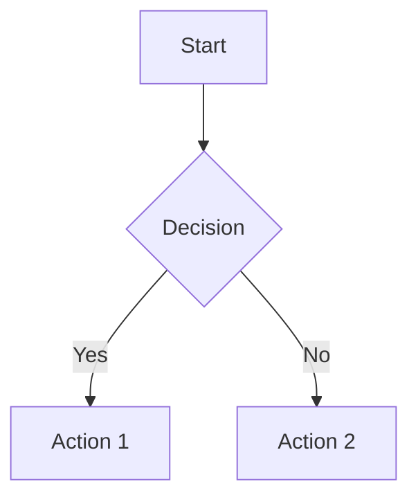

# 🌱 Hello World Blog

**Language Seed's Blog** - Notes to self, articles and content to share with others.

**🌐 Live Blog:** [https://languageseed.github.io/hello_world/](https://languageseed.github.io/hello_world/)

A beautiful, simple blog system powered by Markdown and Mermaid diagrams, based on the Merman template.

## ✨ Features

- 📝 **Markdown Support** - Write posts in simple, clean Markdown
- 📊 **Mermaid Diagrams** - Create flowcharts, sequence diagrams, mind maps, and more
- 🖼️ **Images & Media** - Easily add images, videos, and other media
- 💻 **Code Highlighting** - Beautiful syntax highlighting for code blocks
- 🎨 **Gorgeous Design** - Modern, responsive design with beautiful typography
- ⚡ **Fast & Simple** - Static HTML generation, no complex setup needed
- 📱 **Responsive** - Looks great on desktop, tablet, and mobile

## 🚀 Quick Start

### 1. Create a New Blog Post

Create a markdown file in the `content/` folder:

```bash
nano content/my-first-post.md
```

Add frontmatter and content:

```markdown
---
title: My First Blog Post
author: Your Name
date: 2025-11-12
---

# Hello World!

This is my first blog post. I can write **bold** text, *italic* text, and even add code:

\`\`\`python
print("Hello, World!")
\`\`\`

## Adding Diagrams

\`\`\`mermaid
graph TD
    A[Start] --> B[Write Post]
    B --> C[Generate HTML]
    C --> D[Publish!]
\`\`\`
```

### 2. Generate the HTML

Run the generator script:

```bash
python scripts/generate_post.py content/my-first-post.md
```

This will create `posts/my-first-post.html`.

### 3. View Your Post

Open the generated HTML file in your browser, or add it to `index.html` to list it on your main page.

## 📁 Directory Structure

```
Language_Seed_AI_Hello_World/
├── 📄 index.html              # Main blog index page
├── 📖 README.md               # This file
├── 🔧 .gitignore              # Git ignore rules
│
├── 📝 content/                # Your markdown posts (SOURCE)
│   ├── 2025-11-12-getting-started.md
│   ├── example-post.md
│   └── test-mermaid.md
│
├── 📄 posts/                  # Generated HTML (OUTPUT)
│   ├── 2025-11-12-getting-started.html
│   ├── example-post.html
│   └── test-mermaid.html
│
├── 🖼️ images/                 # Your images and media
│   └── README.md
│
├── 🎵 audio/                  # Your audio files
│   └── README.md
│
├── 🎨 assets/                 # Additional assets (CSS, JS, etc.)
│
├── 🛠️ scripts/                # Build and utility scripts
│   ├── generate_post.py       # Post generator
│   ├── update_index.py        # Index helper
│   └── convert_audio.py       # Audio converter (HQ MP3)
│
├── 📐 templates/              # HTML templates
│   └── template.html          # Blog post template
│
└── 📚 docs/                   # Documentation
    ├── DEPLOYMENT.md          # Deployment guide
    ├── QUICK_START.md         # Quick start guide
    └── POST_WORKFLOW.md       # Post workflow details
```

## 📝 Writing Posts

### Frontmatter

Every post should start with YAML frontmatter:

```markdown
---
title: Your Post Title
author: Your Name
date: 2025-11-12
---
```

### Markdown Syntax

You can use all standard Markdown features:

- **Bold** text: `**bold**`
- *Italic* text: `*italic*`
- `Inline code`: `` `code` ``
- Links: `[text](url)`
- Images: ``
- Lists, tables, blockquotes, and more!

### Adding Images

1. Place your images in the `images/` folder
2. Reference them in your markdown:

```markdown

```

Images will automatically be:
- Responsive and properly sized
- Beautifully styled with rounded corners and shadows
- Optimized for all devices

### Creating Diagrams

Use Mermaid syntax for diagrams:

````markdown

````

Supported diagram types:
- Flowcharts (`graph` or `flowchart`)
- Sequence diagrams (`sequenceDiagram`)
- Class diagrams (`classDiagram`)
- State diagrams (`stateDiagram`)
- ER diagrams (`erDiagram`)
- Gantt charts (`gantt`)
- Pie charts (`pie`)
- Mind maps (`mindmap`)
- And more!

### Code Blocks

Use fenced code blocks with language specification:

````markdown
```python
def hello():
    print("Hello, World!")
```
````

````markdown
```javascript
const greeting = "Hello, World!";
console.log(greeting);
```
````

## 🎨 Customization

### Modify the Template

Edit `template.html` to customize:
- Colors (CSS variables in `:root`)
- Fonts
- Layout
- Styling

### Add Custom CSS

Add custom styles in the `<style>` section of `template.html`.

### Change Colors

All colors are defined as CSS variables:

```css
:root {
    --bg-primary: #3b82f6;      /* Blue */
    --bg-secondary: #10b981;    /* Green */
    --bg-accent: #f59e0b;       /* Amber */
    --text-primary: #1f2937;    /* Dark gray */
    /* ... and more */
}
```

## 🌐 Publishing

### Option 1: GitHub Pages

1. Push your repository to GitHub
2. Go to Settings → Pages
3. Select your branch and save
4. Your blog will be live at `https://yourusername.github.io/hello_world`

### Option 2: Any Static Host

Upload the following to your web host:
- `index.html`
- `posts/` folder
- `images/` folder
- `assets/` folder

### Option 3: Local Viewing

Simply open `index.html` in your web browser to view locally.

## 📚 Example Post

Check out `example-post.md` and the generated `posts/example-post.html` to see all features in action!

## 🛠️ Requirements

- Python 3.6+ (for the generator script)
- A modern web browser (for viewing)

No other dependencies needed - everything uses CDN-hosted libraries!

## 📖 Usage Examples

### Generate a post:
```bash
python scripts/generate_post.py content/my-post.md
```

### Generate with custom output:
```bash
python scripts/generate_post.py content/my-post.md posts/custom-name.html
```

### Create and generate a new post:
```bash
# Create the post
nano content/2025-11-13-new-post.md

# Generate it
python scripts/generate_post.py content/2025-11-13-new-post.md

# Preview
open posts/2025-11-13-new-post.html
```

## 🤝 Contributing

This is a personal blog, but feel free to:
- Fork the repository
- Use it for your own blog
- Suggest improvements
- Share your customizations

## 📄 License

Free to use and modify for your own projects!

## 🙏 Credits

- Based on the [Merman](file:///Users/ben/Documents/merman/merman.html) template
- Powered by [Marked.js](https://marked.js.org/) for Markdown parsing
- Diagrams by [Mermaid.js](https://mermaid.js.org/)
- Fonts: Inter & Montserrat from Google Fonts

## 📞 Support

For questions or issues, please check the example post or open an issue on GitHub.

---

**Happy Blogging! 🚀**

*Built with ❤️ by Language Seed*
