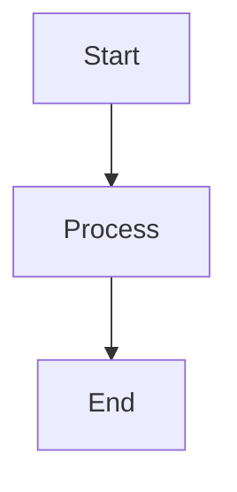

# 🌱 Hello World Blog

**Language Seed's Blog** - Notes to self, articles and content to share with others.

**🌐 Live Blog:** [https://languageseed.github.io/hello_world/](https://languageseed.github.io/hello_world/)

A beautiful, modern blog system built with **SvelteKit**, **shadcn-svelte**, and **Lucide icons**, powered by Markdown and Mermaid diagrams.

## ✨ Features

- 📝 **Markdown Support** - Write posts in simple, clean Markdown with full GFM support
- 📊 **Mermaid Diagrams** - Create flowcharts, sequence diagrams, mind maps, and more
- 🖼️ **Images & Media** - Easily add images with automatic responsive sizing
- 🎵 **Audio Players** - Beautiful Howler.js-powered audio players with play, seek, and volume controls
- 💻 **Code Highlighting** - Beautiful syntax highlighting for code blocks
- 🎨 **Modern UI** - Built with shadcn-svelte components and Lucide SVG icons
- ⚡ **Fast & Static** - Pre-rendered static site for GitHub Pages
- 📱 **Responsive** - Looks great on desktop, tablet, and mobile
- 🐠 **Merman Scratchpad** - Built-in Markdown & Mermaid preview tool
- 🎼 **Audio Converter** - FFmpeg-powered HQ MP3 converter (320k stereo)

## 🚀 Quick Start

### Prerequisites

- **Node.js** 18+ and npm
- **Git** for version control

### 1. Install Dependencies

```bash
npm install
```

### 2. Create a New Blog Post

Create a markdown file in the `content/` folder:

```bash
nano content/my-first-post.md
```

Add frontmatter and content:

```markdown
---
title: My First Blog Post
author: Your Name
date: 2025-11-12
---

# Hello World!

This is my first blog post. I can write **bold** text, *italic* text, and even add code:

\`\`\`python
print("Hello, World!")
\`\`\`

## Adding Diagrams

\`\`\`mermaid
graph TD
    A[Start] --> B[Write Post]
    B --> C[Build Site]
    C --> D[Deploy!]
\`\`\`

## Adding Audio

<audio src="../audio/my-track.mp3" data-title="My Track Title"></audio>
```

### 3. Build the Site

```bash
npm run build
```

This generates a static site in the `build/` folder, ready for GitHub Pages!

### 4. Preview Locally

```bash
npm run preview
```

Visit `http://localhost:4173/hello_world/` to see your site.

### 5. Deploy to GitHub Pages

```bash
# Build the site
npm run build

# Commit and push
git add build/
git commit -m "Build site"
git push
```

The `build/` folder contains all static files ready for GitHub Pages!

## 🛠️ Development

### Run Development Server

```bash
npm run dev
```

Visit `http://localhost:5173` to see your site with hot reload.

### Project Structure

```
Language_Seed_AI_Hello_World/
├── content/              # Markdown blog posts
├── static/              # Static assets (audio, images)
│   ├── audio/          # Audio files
│   └── images/         # Images
├── src/
│   ├── lib/
│   │   ├── components/  # Svelte components
│   │   │   ├── ui/      # shadcn components
│   │   │   ├── AudioPlayer.svelte
│   │   │   ├── MarkdownContent.svelte
│   │   │   └── PostCard.svelte
│   │   └── utils/       # Utilities
│   └── routes/          # SvelteKit routes
│       ├── +page.svelte # Index page
│       ├── posts/[slug]/ # Dynamic post routes
│       └── merman/       # Scratchpad page
├── build/               # Generated static site (git ignored)
└── OLD_SYSTEM/          # Archived Python-based system
```

## 🎨 UI Components

This blog uses **shadcn-svelte** components:

- **Card** - Post cards and feature tiles
- **Button** - Navigation and actions
- **Badge** - Tags and labels
- **Slider** - Audio progress bars

All styled with **Tailwind CSS** and enhanced with **Lucide SVG icons**.

## 🐠 Merman Scratchpad

Quick Markdown & Mermaid preview tool:

```bash
# Visit in browser after building
npm run build
npm run preview
# Navigate to /hello_world/merman
```

Or visit: [https://languageseed.github.io/hello_world/merman](https://languageseed.github.io/hello_world/merman)

Features:
- Live Markdown preview
- Mermaid diagram rendering
- localStorage persistence
- Copy to clipboard
- Download as markdown

## 🎼 Audio Converter

Convert all audio files to HQ MP3 (320k stereo):

```bash
# Preview what will be converted
python scripts/convert_audio.py --dry-run

# Convert all audio files (removes originals)
python scripts/convert_audio.py

# Auto mode (no confirmation)
python scripts/convert_audio.py --force
```

**Supported formats:** `.wav`, `.flac`, `.aac`, `.ogg`, `.webm`, `.m4a`, `.wma`, `.aiff`, `.aif`, `.opus`, `.oga`, `.mp3`

## 📝 Writing Posts

### Frontmatter

Every post needs frontmatter:

```yaml
---
title: Post Title
author: Author Name
date: 2025-11-12
---
```

### Markdown Features

- **Headers** - `# H1`, `## H2`, `### H3`
- **Bold** - `**bold**`
- **Italic** - `*italic*`
- **Links** - `[text](url)`
- **Images** - ``
- **Code blocks** - Triple backticks with language
- **Lists** - `- item` or `1. item`

### Mermaid Diagrams

Use code blocks with `mermaid` language:

````markdown

````

### Audio Players

Add audio players using HTML tags:

```html
<audio src="../audio/track.mp3" data-title="Track Title"></audio>
```

The path should be relative to the `static/audio/` folder (use `/audio/track.mp3` in markdown).

## 🔧 Configuration

### GitHub Pages Base Path

The site is configured for GitHub Pages at `/hello_world/`. To change this:

1. Update `svelte.config.js`:
```javascript
paths: {
  base: '/your-repo-name'
}
```

2. Rebuild: `npm run build`

### Tailwind Theme

Customize colors in `tailwind.config.js`:

```javascript
colors: {
  primary: '#3b82f6',    // Blue
  secondary: '#10b981',  // Green
  accent: '#f59e0b',     // Amber
  contrast: '#7c3aed',   // Purple
}
```

## 📦 Dependencies

### Core
- **SvelteKit** - Framework
- **@sveltejs/adapter-static** - Static site generation
- **Tailwind CSS** - Styling
- **shadcn-svelte** - UI components
- **Lucide Svelte** - Icons

### Content
- **marked** - Markdown parsing
- **gray-matter** - Frontmatter parsing
- **mdsvex** - Markdown preprocessing
- **mermaid** - Diagram rendering

### Media
- **howler** - Audio playback
- **reading-time** - Reading time calculation

## 🚀 Deployment

### GitHub Pages

1. Build the site:
```bash
npm run build
```

2. Commit the `build/` folder:
```bash
git add build/
git commit -m "Build site"
git push
```

3. Configure GitHub Pages to serve from `/build` directory

### Alternative: GitHub Actions

Create `.github/workflows/deploy.yml`:

```yaml
name: Deploy to GitHub Pages

on:
  push:
    branches: [main]

jobs:
  build:
    runs-on: ubuntu-latest
    steps:
      - uses: actions/checkout@v4
      - uses: actions/setup-node@v4
        with:
          node-version: '18'
      - run: npm install
      - run: npm run build
      - uses: peaceiris/actions-gh-pages@v3
        with:
          github_token: ${{ secrets.GITHUB_TOKEN }}
          publish_dir: ./build
```

## 📚 Migration from Python System

The old Python-based system has been archived in `OLD_SYSTEM/`. Key changes:

### Old Workflow
```bash
python scripts/generate_post.py content/post.md
```

### New Workflow
```bash
npm run build
```

**Benefits:**
- ✅ Automatic post discovery (no manual index updates)
- ✅ Modern component system
- ✅ Better code organization
- ✅ TypeScript support
- ✅ Hot reload in development

## 🐛 Troubleshooting

### Build Fails

- Ensure Node.js 18+ is installed
- Run `npm install` to ensure dependencies are up to date
- Check for TypeScript errors: `npm run check`

### Posts Not Showing

- Ensure markdown files are in `content/` folder
- Check frontmatter format (YAML with `---`)
- Verify file names match slugs in URLs

### Audio Not Playing

- Ensure audio files are in `static/audio/`
- Use correct path format: `/audio/filename.mp3`
- Check browser console for errors

### Mermaid Not Rendering

- Ensure code blocks use `mermaid` language tag
- Check browser console for Mermaid errors
- Verify Mermaid syntax is correct

## 📄 License

This project uses the following open-source libraries:

- **Mermaid.js** - Apache 2.0 License
- **Marked.js** - MIT License
- **Howler.js** - MIT License
- **Lucide Icons** - ISC License
- **shadcn-svelte** - MIT License

All content is © 2025 Language Seed.

## 🙏 Credits

- **SvelteKit** - Amazing framework
- **shadcn/ui** - Beautiful component system
- **Lucide** - Professional icon set
- **Tailwind CSS** - Utility-first CSS framework

---

**Built with ❤️ using SvelteKit, shadcn-svelte, and Lucide icons**
