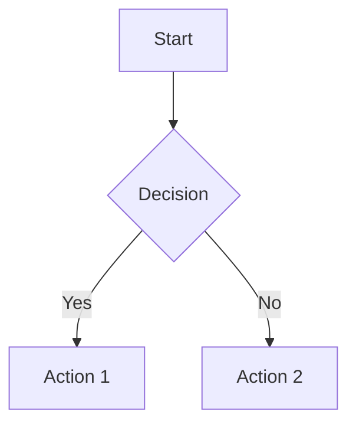

# 🌱 Hello World Blog

**Language Seed's Blog** - Notes to self, articles and content to share with others.

**🌐 Live Blog:** [https://languageseed.github.io/hello_world/](https://languageseed.github.io/hello_world/)

A beautiful, simple blog system powered by Markdown and Mermaid diagrams, based on the Merman template.

## ✨ Features

- 📝 **Markdown Support** - Write posts in simple, clean Markdown
- 📊 **Mermaid Diagrams** - Create flowcharts, sequence diagrams, mind maps, and more
- 🖼️ **Images & Media** - Easily add images, videos, and other media
- 🎵 **Audio Players** - Beautiful Howler.js-powered audio players with play, seek, and volume controls
- 💻 **Code Highlighting** - Beautiful syntax highlighting for code blocks
- 🎨 **Gorgeous Design** - Modern, responsive design with beautiful typography
- ⚡ **Fast & Simple** - Static HTML generation, no complex setup needed
- 📱 **Responsive** - Looks great on desktop, tablet, and mobile
- 🐠 **Merman Scratchpad** - Built-in Markdown & Mermaid preview tool for quick testing
- 🔄 **Auto-Index Update** - Index automatically updates when you generate posts
- 🎼 **Audio Converter** - FFmpeg-powered HQ MP3 converter (320k stereo)

## 🚀 Quick Start

### 1. Create a New Blog Post

Create a markdown file in the `content/` folder:

```bash
nano content/my-first-post.md
```

Add frontmatter and content:

```markdown
---
title: My First Blog Post
author: Your Name
date: 2025-11-12
---

# Hello World!

This is my first blog post. I can write **bold** text, *italic* text, and even add code:

\`\`\`python
print("Hello, World!")
\`\`\`

## Adding Diagrams

\`\`\`mermaid
graph TD
    A[Start] --> B[Write Post]
    B --> C[Generate HTML]
    C --> D[Publish!]
\`\`\`
```

### 2. Generate the HTML

Run the generator script:

```bash
python scripts/generate_post.py content/my-first-post.md
```

This will create `posts/my-first-post.html`.

### 3. View Your Post

Open the generated HTML file in your browser. The index automatically updates with your new post!

## 🛠️ Utility Tools

### Merman Scratchpad

Quick Markdown & Mermaid preview tool:
```bash
# Open in browser
open merman.html
# Or visit: https://languageseed.github.io/hello_world/merman.html
```

Use it to test diagrams and markdown before adding to posts!

### Audio Converter

Convert all audio files to HQ MP3 (320k stereo):
```bash
# Preview what will be converted
python scripts/convert_audio.py --dry-run

# Convert all audio files (removes originals)
python scripts/convert_audio.py

# Auto mode (no confirmation)
python scripts/convert_audio.py --force
```

Supports: WAV, FLAC, AAC, OGG, WebM, M4A, AIFF, AIF, OPUS, MP3

### Index Updater

The index updates automatically when you generate posts! Manual update if needed:
```bash
python scripts/update_index.py
```

## 📁 Directory Structure

```
Language_Seed_AI_Hello_World/
├── 📄 index.html              # Main blog index page
├── 🐠 merman.html             # Markdown & Mermaid scratchpad utility
├── 📖 README.md               # This file
├── 🔧 .gitignore              # Git ignore rules
│
├── 📝 content/                # Your markdown posts (SOURCE)
│   ├── 2025-11-12-getting-started.md
│   ├── example-post.md
│   └── test-mermaid.md
│
├── 📄 posts/                  # Generated HTML (OUTPUT)
│   ├── 2025-11-12-getting-started.html
│   ├── example-post.html
│   └── test-mermaid.html
│
├── 🖼️ images/                 # Your images and media
│   └── README.md
│
├── 🎵 audio/                  # Your audio files
│   └── README.md
│
├── 🎨 assets/                 # Additional assets (CSS, JS, etc.)
│
├── 🛠️ scripts/                # Build and utility scripts
│   ├── generate_post.py       # Post generator
│   ├── update_index.py        # Index helper
│   └── convert_audio.py       # Audio converter (HQ MP3)
│
├── 📐 templates/              # HTML templates
│   └── template.html          # Blog post template
│
└── 📚 docs/                   # Documentation
    ├── DEPLOYMENT.md          # Deployment guide
    ├── QUICK_START.md         # Quick start guide
    ├── POST_WORKFLOW.md       # Post workflow details
    ├── NEW_WORKFLOW.md        # Auto-index workflow
    ├── AUDIO_GUIDE.md         # Audio playback guide
    └── AUDIO_CONVERTER_GUIDE.md # FFmpeg converter guide
```

## 📝 Writing Posts

### Frontmatter

Every post should start with YAML frontmatter:

```markdown
---
title: Your Post Title
author: Your Name
date: 2025-11-12
---
```

### Markdown Syntax

You can use all standard Markdown features:

- **Bold** text: `**bold**`
- *Italic* text: `*italic*`
- `Inline code`: `` `code` ``
- Links: `[text](url)`
- Images: ``
- Lists, tables, blockquotes, and more!

### Adding Images

1. Place your images in the `images/` folder
2. Reference them in your markdown:

```markdown

```

Images will automatically be:
- Responsive and properly sized
- Beautifully styled with rounded corners and shadows
- Optimized for all devices

### Creating Diagrams

Use Mermaid syntax for diagrams:

````markdown

````

Supported diagram types:
- Flowcharts (`graph` or `flowchart`)
- Sequence diagrams (`sequenceDiagram`)
- Class diagrams (`classDiagram`)
- State diagrams (`stateDiagram`)
- ER diagrams (`erDiagram`)
- Gantt charts (`gantt`)
- Pie charts (`pie`)
- Mind maps (`mindmap`)
- And more!

### Code Blocks

Use fenced code blocks with language specification:

````markdown
```python
def hello():
    print("Hello, World!")
```
````

````markdown
```javascript
const greeting = "Hello, World!";
console.log(greeting);
```
````

### Adding Audio

1. Place your audio files in the `audio/` folder
2. Use HTML5 audio tag in your markdown:

```markdown
<audio src="../audio/my-song.mp3" data-title="My Song Title"></audio>
```

Audio features:
- Beautiful custom Howler.js players
- Play/pause, seek, volume controls
- Progress bar with time display
- Mobile-responsive design
- Supports MP3, WebM, OGG, WAV, AAC, FLAC

**Convert to HQ MP3 (320k stereo):**
```bash
python scripts/convert_audio.py
```

See `docs/AUDIO_GUIDE.md` for complete documentation.

## 🐠 Merman Scratchpad Utility

Built-in Markdown & Mermaid preview tool for quick testing!

**Access:** Visit `merman.html` or click the button on the blog index

**Features:**
- Real-time Markdown and Mermaid preview
- Split-pane interface (editor + preview)
- Auto-save to browser localStorage
- Draggable splitter
- Auto-wraps pasted Mermaid diagrams
- Perfect for testing before adding to posts

**Use it to:**
- Test Mermaid diagram syntax
- Preview markdown formatting
- Draft content quickly
- Experiment with layouts
- Learn Mermaid syntax

**Live URL:** [https://languageseed.github.io/hello_world/merman.html](https://languageseed.github.io/hello_world/merman.html)

## 🎨 Customization

### Modify the Template

Edit `template.html` to customize:
- Colors (CSS variables in `:root`)
- Fonts
- Layout
- Styling

### Add Custom CSS

Add custom styles in the `<style>` section of `template.html`.

### Change Colors

All colors are defined as CSS variables:

```css
:root {
    --bg-primary: #3b82f6;      /* Blue */
    --bg-secondary: #10b981;    /* Green */
    --bg-accent: #f59e0b;       /* Amber */
    --text-primary: #1f2937;    /* Dark gray */
    /* ... and more */
}
```

## 🌐 Publishing

### Option 1: GitHub Pages

1. Push your repository to GitHub
2. Go to Settings → Pages
3. Select your branch and save
4. Your blog will be live at `https://yourusername.github.io/hello_world`

### Option 2: Any Static Host

Upload the following to your web host:
- `index.html`
- `posts/` folder
- `images/` folder
- `assets/` folder

### Option 3: Local Viewing

Simply open `index.html` in your web browser to view locally.

## 📚 Example Post

Check out `example-post.md` and the generated `posts/example-post.html` to see all features in action!

## 🛠️ Requirements

### Essential
- Python 3.6+ (for the generator scripts)
- A modern web browser (for viewing)

### Optional (for audio features)
- FFmpeg (for audio conversion to HQ MP3)
  ```bash
  # macOS
  brew install ffmpeg
  
  # Ubuntu
  sudo apt install ffmpeg
  ```

**Note:** All web libraries (Marked.js, Mermaid.js, Howler.js) are loaded from CDN - no installation needed!

## 📖 Usage Examples

### Generate a post:
```bash
python scripts/generate_post.py content/my-post.md
```

### Generate with custom output:
```bash
python scripts/generate_post.py content/my-post.md posts/custom-name.html
```

### Create and generate a new post:
```bash
# Create the post
nano content/2025-11-13-new-post.md

# Generate it (index auto-updates!)
python scripts/generate_post.py content/2025-11-13-new-post.md

# Preview
open posts/2025-11-13-new-post.html

# Deploy
git add .
git commit -m "Add new post"
git push origin main
```

### Create a post with audio:
```bash
# Add audio file
cp my-song.wav audio/

# Convert to HQ MP3 (320k)
python scripts/convert_audio.py --force

# Create post with audio player
cat > content/my-music-post.md << 'EOF'
---
title: My Music
author: language seed
date: 2025-11-13
---

# Listen to My Track

<audio src="../audio/my-song.mp3" data-title="My Song"></audio>
EOF

# Generate and deploy
python scripts/generate_post.py content/my-music-post.md
git add . && git commit -m "Add music post" && git push
```

### Test content in Merman:
```bash
# Open the scratchpad
open merman.html

# Or visit online
open https://languageseed.github.io/hello_world/merman.html
```

## 🤝 Contributing

This is a personal blog, but feel free to:
- Fork the repository
- Use it for your own blog
- Suggest improvements
- Share your customizations

## 📄 License

Free to use and modify for your own projects!

## 🙏 Credits

- Based on the [Merman](file:///Users/ben/Documents/merman/merman.html) template
- Powered by [Marked.js](https://marked.js.org/) for Markdown parsing (MIT License)
- Diagrams by [Mermaid.js](https://mermaid.js.org/) (MIT License)
- Audio playback by [Howler.js](https://howlerjs.com/) (MIT License)
- Fonts: Inter & Montserrat from Google Fonts (Open Font License)

**All libraries used are open-source with permissive licenses allowing free personal and commercial use.**

## 📞 Support

For questions or issues, please check the example post or open an issue on GitHub.

---

**Happy Blogging! 🚀**

*Built with ❤️ by Language Seed*
