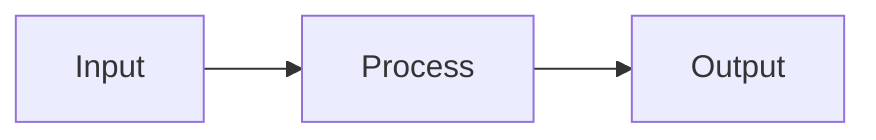

# 🌱 Hello World

**Ben McIntyre's AI Portfolio & Blog** - Documenting the journey of building AI infrastructure.

**🌐 Live Site:** [https://languageseed.github.io/hello_world/](https://languageseed.github.io/hello_world/)

A modern portfolio and blog built with **SvelteKit**, **Tailwind CSS**, and **Lucide icons**, featuring AI project showcases, career profile, and technical articles.

## 🎯 Site Structure

| Page | Description |
|------|-------------|
| **[Portfolio](https://languageseed.github.io/hello_world/)** | Tiled grid of AI projects with hero images |
| **[Blog](https://languageseed.github.io/hello_world/blog)** | Scrollable list of all articles and posts |
| **[About](https://languageseed.github.io/hello_world/about)** | Career profile with 20+ years experience timeline |
| **[Merman](https://languageseed.github.io/hello_world/merman)** | Live Markdown & Mermaid diagram scratchpad |

## 🚀 Featured Projects

- **Valet Model Runtime** - Unified LLM inference gateway for local and cloud models
- **Valet Agent Platform** - AI agent framework with memory, skills, and tool integration
- **Valet Video** - Real-time video & voice AI via WebRTC (SAM3, Moshi)
- **Content Processor** - Document processing pipeline (46 modules, 24 pipelines)
- **Search Gateway** - Federated search orchestrator with AI-powered query enhancement
- **Vacuum** - Web scraping and knowledge ingestion for LLMs
- **Email Agent** - AI-powered email search and summarization
- **ComfyUI Valet Agent** - Natural language image generation
- **Valet Visual** - Computer vision API (YOLO, SAM2)
- **Valet Voice** - Speech-to-text and text-to-speech services

## ✨ Features

- 📊 **Portfolio Grid** - Tiled project cards with hero images and tags
- 📝 **Markdown Blog** - Full GFM support with syntax highlighting
- 👤 **Career Profile** - Experience timeline, certifications, skills
- 📈 **Mermaid Diagrams** - Flowcharts, sequence diagrams, architecture visuals
- 🎵 **Audio Players** - Howler.js-powered with seek and volume controls
- 🌙 **Dark/Light Mode** - Theme toggle with system preference detection
- 📱 **Responsive** - Mobile-first design
- ⚡ **Static & Fast** - Pre-rendered for GitHub Pages

## 🛠️ Quick Start

### Prerequisites

- **Node.js** 18+ and npm
- **Git** for version control

### Install & Run

```bash
# Install dependencies
npm install

# Development server (hot reload)
npm run dev

# Build for production
npm run build

# Preview production build
npm run preview
```

### Create a New Post

Create a markdown file in `content/`:

```markdown
---
title: My Project Title
author: Language Seed
date: 2026-01-14
tags: [ai, project, homelab]
category: projects
---

# Project Name

Your content here...

## Architecture


```

### Deploy to GitHub Pages

```bash
npm run build
git add build/
git commit -m "Build site"
git push
```

## 📁 Project Structure

```
hello_world/
├── content/              # Markdown blog posts
├── static/
│   ├── audio/           # Audio files
│   └── images/          # Hero images, screenshots
├── src/
│   ├── lib/
│   │   ├── components/  # Svelte components
│   │   └── utils/       # Utilities
│   └── routes/
│       ├── +page.svelte      # Portfolio (home)
│       ├── blog/             # Blog list page
│       ├── about/            # Career profile
│       ├── posts/[slug]/     # Individual post pages
│       └── merman/           # Scratchpad
└── build/               # Generated static site
```

## 🎨 Tech Stack

| Component | Technology |
|-----------|------------|
| Framework | SvelteKit |
| Styling | Tailwind CSS |
| Icons | Lucide Svelte |
| Markdown | marked + gray-matter |
| Diagrams | Mermaid.js |
| Audio | Howler.js |
| Deployment | GitHub Pages (static) |

## 🔧 Configuration

### GitHub Pages Base Path

Update `svelte.config.js`:

```javascript
paths: {
  base: '/your-repo-name'
}
```

### Theme Customization

Edit `src/app.css` for colors and `tailwind.config.js` for fonts:

```css
:root {
  --primary: 180 100% 50%; /* Electric Cyan */
  --background: 225 25% 4%;
}
```

## 📄 License

Content © 2026 Ben McIntyre / Language Seed.

Open-source libraries used under their respective licenses (MIT, Apache 2.0, ISC).

---

**Built with SvelteKit, Tailwind CSS, and Lucide icons** 🌱
