# Getting Started with Language Seed Blog

Welcome to my new blog! This is my first real post where I'll share my thoughts and ideas.

## Why I Started This Blog

I wanted a simple, beautiful way to share my knowledge and experiences. This blog system gives me:

- 📝 **Easy writing** with Markdown
- 🎨 **Beautiful design** out of the box
- 📊 **Powerful diagrams** with Mermaid
- 🚀 **Free hosting** on GitHub Pages

## My Workflow

Here's how I write a new post:


## What I'll Write About

I'm planning to cover topics like:

1. **Technology** - Programming, tools, and workflows
2. **Learning** - Notes on things I'm studying
3. **Projects** - Updates on what I'm building
4. **Ideas** - Random thoughts and musings

## Example Code

I can easily share code snippets:

```python
def hello_world():
    """A simple greeting function"""
    print("Hello from Language Seed!")
    return "Welcome to my blog"

# Let's call it
message = hello_world()
```

And JavaScript too:

```javascript
const blog = {
    name: "Hello World",
    author: "Language Seed",
    topics: ["tech", "learning", "ideas"],
    isAwesome: true
};

console.log(`Welcome to ${blog.name}!`);
```

## Visual Elements

I can include all kinds of visual elements to make posts engaging.

### Tables

| Feature | Available | Notes |
|---------|-----------|-------|
| Markdown | ✅ | Full GFM support |
| Diagrams | ✅ | Mermaid.js |
| Images | ✅ | In images/ folder |
| Videos | ✅ | Embed support |
| Math | 🚧 | Could add KaTeX |

### Lists

My top 3 favorite things about this setup:

1. **Simplicity** - Just write markdown files
2. **Speed** - Generate and deploy in seconds
3. **Beauty** - Professional design without effort

### Quotes

> "The best time to start was yesterday. The next best time is now."
> 
> — Ancient Proverb

## System Architecture

Here's how the blog system works under the hood:

```mermaid
graph TD
    A[Write Markdown] --> B[generate_post.py]
    B --> C[Read Frontmatter]
    B --> D[Read Content]
    C --> E[template.html]
    D --> E
    E --> F[Replace Placeholders]
    F --> G[posts/your-post.html]
    G --> H[Git Push]
    H --> I[GitHub Pages]
    I --> J[Live Blog! 🎉]
    
    style A fill:#3b82f6,color:#fff
    style E fill:#f59e0b,color:#000
    style J fill:#10b981,color:#fff
```



## Next Steps

In my next posts, I'll dive deeper into:

- How to customize the blog design
- Advanced Mermaid diagram techniques
- Adding custom features
- SEO optimization for GitHub Pages

Stay tuned! 🚀

---

## Resources

- [My GitHub](https://github.com/languageseed)
- [Markdown Guide](https://www.markdownguide.org/)
- [Mermaid Docs](https://mermaid.js.org/)

*Published on November 12, 2025*

