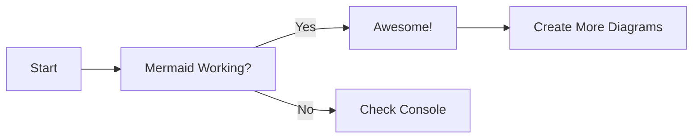
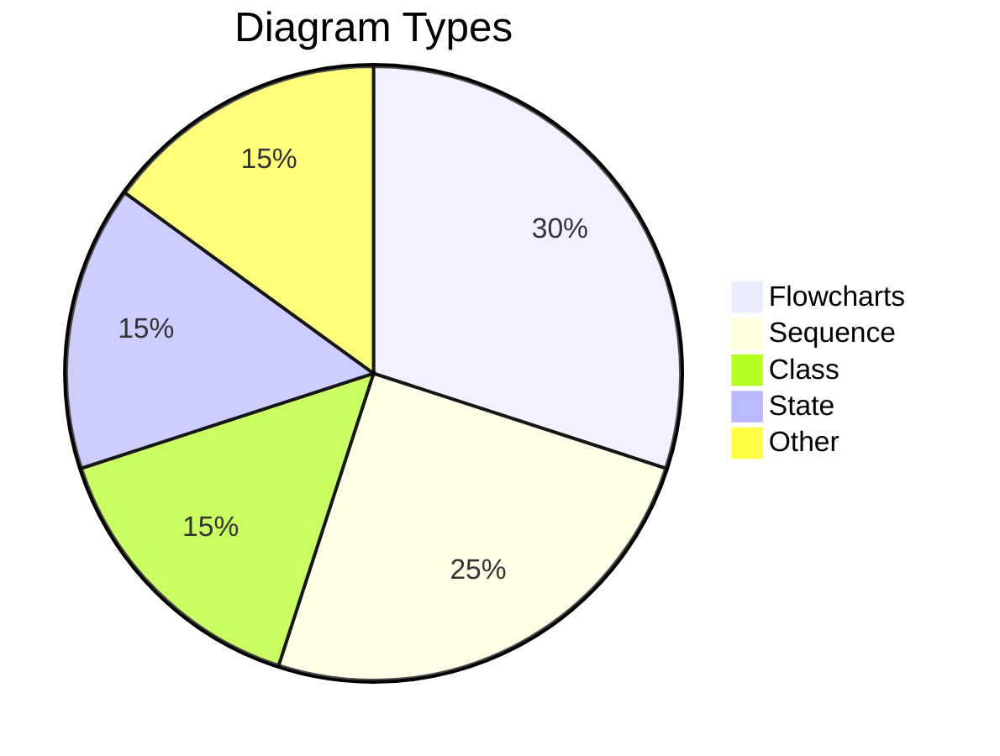
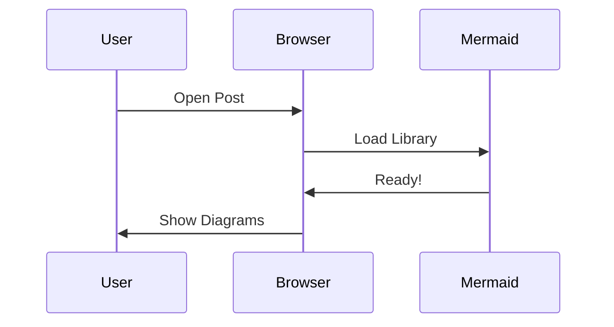

# Testing Mermaid Diagrams

This is a quick test to verify Mermaid diagrams are rendering correctly.

## Simple Flowchart

## Pie Chart

## Simple Sequence

If you see the diagrams above, everything is working! 🎉

