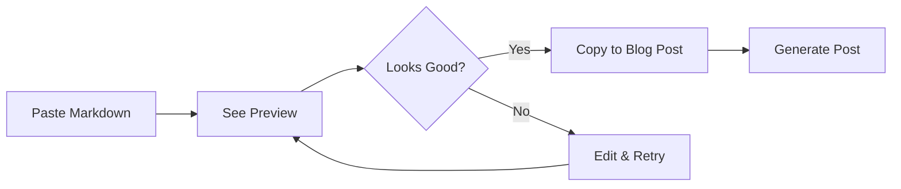
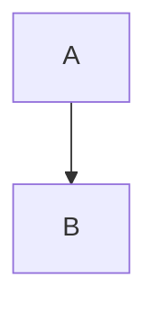
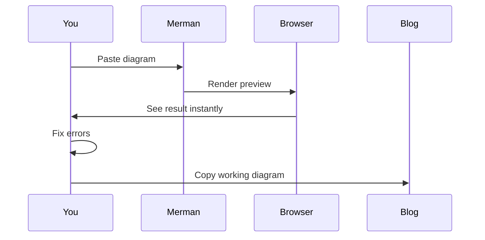
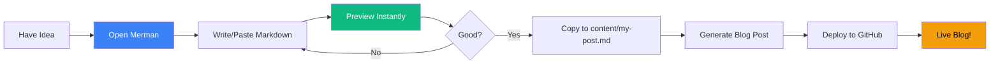

# 🐠 Merman - Your Instant Preview Tool

Need to quickly preview some Markdown or test a Mermaid diagram? Meet **Merman** - your go-to scratchpad for instant visual feedback!

## What is Merman?

Merman is a simple, powerful utility page that lets you paste and preview Markdown and Mermaid diagrams in real-time. No need to generate a full blog post just to see if your diagram syntax is correct!

**Access it here:** [Open Merman Scratchpad](../merman.html)

---

## Why You Need This

### Quick Testing

Before adding content to your blog posts, use Merman to:

- ✅ Test Mermaid diagram syntax
- ✅ Preview markdown formatting
- ✅ Check code block styling
- ✅ Experiment with table layouts
- ✅ Verify blockquote appearance

### Real-Time Preview



### Auto-Save Feature

Your work is automatically saved to browser localStorage - come back later and it's still there!

---

## Features

### Split-Pane Interface

- **Left Pane:** Editor where you type/paste markdown
- **Right Pane:** Live preview of rendered content
- **Draggable Splitter:** Adjust pane sizes to your preference

### Smart Mermaid Detection

Paste a raw Mermaid diagram and it automatically wraps it in code fences:

**You paste:**
```
graph TD
    A --> B
```

**Merman wraps it:**


**You see:** Beautiful rendered diagram!

### Auto-Save to Browser

Leave and come back - your content is still there! Uses localStorage to persist your work.

---

## Common Use Cases

### 1. Testing Diagram Syntax

When creating complex diagrams:



### 2. Formatting Tables

Preview table layouts before adding to posts:

| Column 1 | Column 2 | Column 3 |
|----------|----------|----------|
| Data | Data | Data |
| Test | Preview | Perfect! |

### 3. Testing Code Blocks

See how code appears:

```python
def test_formatting():
    """Check if this looks good"""
    return "Perfect!"
```

### 4. Quick Notes

Use it as a scratchpad for ideas and notes that you might turn into blog posts later.

---

## How to Use

### Basic Workflow

1. **Open Merman:** Click the button on the blog index or visit `merman.html`
2. **Paste/Type:** Add your markdown or Mermaid syntax
3. **Preview:** See the rendered output instantly
4. **Copy:** When it looks good, copy to your actual blog post

### Example Session

```markdown
# Testing My Diagram

Let me see if this works:

\`\`\`mermaid
graph TD
    Start --> Middle
    Middle --> End
\`\`\`

Looks good! Now I'll add it to my blog post.
```

### Keyboard Tips

- **Ctrl/Cmd + A:** Select all
- **Ctrl/Cmd + C:** Copy selected text
- **Tab:** Insert tab (for code indentation)

---

## Behind the Scenes

Merman uses the same technology as your blog posts:

- **Marked.js** - Markdown parsing
- **Mermaid.js** - Diagram rendering
- **localStorage** - Auto-save feature
- **Same CSS** - Consistent styling with blog

This means what you see in Merman is **exactly** what you'll see in your blog posts!

---

## Pro Tips

### 1. Test Before Publishing

Always test complex diagrams in Merman first. It's faster than regenerating blog posts repeatedly.

### 2. Use as Template Builder

Create diagram templates in Merman, then copy them to multiple posts.

### 3. Share Diagrams

Need to share a diagram with someone? Create it in Merman, take a screenshot!

### 4. Learning Tool

Experimenting with Mermaid? Use Merman to learn syntax without affecting your blog.

### 5. Draft Ideas

Write rough drafts in Merman, save them in localStorage, polish later.

---

## Comparison: Merman vs Blog Posts

| Feature | Merman | Blog Posts |
|---------|--------|------------|
| **Speed** | Instant | Needs generation |
| **Purpose** | Testing & drafting | Final publication |
| **Editing** | Live typing | Markdown files |
| **Preview** | Real-time | After generation |
| **Persistence** | Browser localStorage | Git repository |
| **Sharing** | Local only | Published online |

**Use both together for the best workflow!** 🚀

---

## Access Merman

**From blog index:** Click the "🐠 Open Merman Scratchpad" button

**Direct link:** `merman.html`

**Live URL:** [https://languageseed.github.io/hello_world/merman.html](https://languageseed.github.io/hello_world/merman.html)

---

## Example Workflow



---

## Why "Merman"?

Because it helps you navigate the sea of Markdown and Mermaid syntax! 🐠🌊

Plus, it's a play on words:
- **Mer**maid (diagrams)
- **M**arkdown (formatting)
- **Man** (your helper tool)

= **Merman!** 🐠

---

## Start Using It Now!

[Open Merman Scratchpad](../merman.html) and start experimenting!

Perfect for:
- 🧪 Testing new diagram types
- 📝 Drafting blog content
- 🎨 Experimenting with formatting
- 🚀 Learning Mermaid syntax
- ⚡ Quick previews

---

**Happy scripting!** ✨

*Merman is your companion tool for creating amazing blog content faster and easier!*

