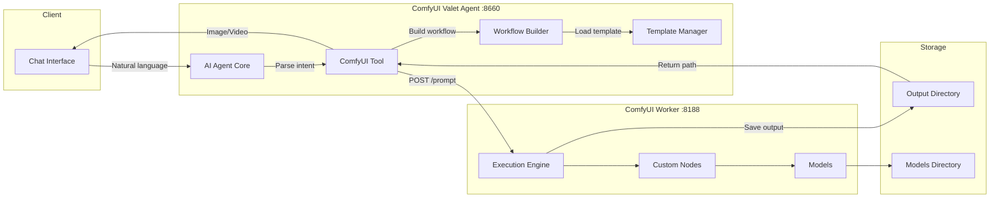
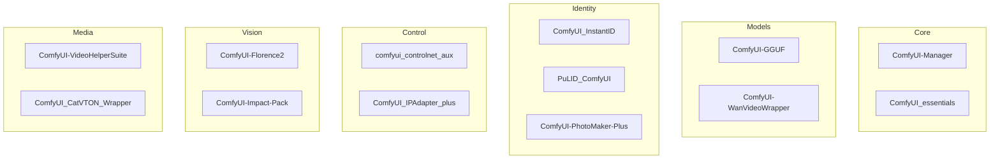

# 🎨 ComfyUI Valet Agent

> Natural language interface for AI image and video generation

**Home Lab Project** · **127GB Models** · **14 Custom Nodes** · **9 Generation Modes**

---

## > The Problem

ComfyUI is incredibly powerful, but:

- **Steep learning curve** - Node-based workflows are complex for simple tasks
- **Manual workflow creation** - Every generation requires building or loading a workflow
- **No API abstraction** - Raw ComfyUI API requires workflow JSON
- **Context switching** - Moving between chat and UI breaks flow

I wanted to generate images and videos through natural conversation, not by manually wiring nodes.

---

## > The Solution

The **ComfyUI Valet Agent** wraps ComfyUI with an AI agent interface. You describe what you want in natural language, and the agent:

1. Parses your intent (generate, upscale, video, etc.)
2. Selects the appropriate model and workflow
3. Builds the workflow JSON dynamically
4. Queues execution and monitors progress
5. Returns the generated image/video

```
User: "Generate a cyberpunk cityscape at night, neon lights, rain"

Agent: Using Flux Schnell for fast generation...
       [Building workflow] → [Queuing] → [Generating]
       ✓ Generated in 4.2s
       [Returns image]
```

---

## > Key Features

- 🗣️ **Natural Language Interface** - Describe what you want, not how to build it
- ⚡ **Smart Model Selection** - Automatically picks optimal model for the task
- 🎬 **Video Generation** - Wan 2.1 text-to-video support
- 🎛️ **ControlNet Support** - Pose, depth, canny edge guidance
- 🖼️ **IP-Adapter** - Use images as style/content prompts
- 🔍 **4x Upscaling** - UltraSharp and RealESRGAN
- ✂️ **Inpainting** - Edit regions with natural language masks
- 🧩 **Segmentation** - SAM-powered object isolation
- 📊 **Progress Streaming** - Real-time generation updates

---

## > Architecture



The agent sits between the user and ComfyUI, translating natural language into executable workflows.

---

## > Generation Modes

| Mode | Description | Models Used |
|------|-------------|-------------|
| `generate` | Text-to-image | SD1.5, SDXL, Flux |
| `img2img` | Image transformation | All checkpoints |
| `controlnet` | Guided generation | + ControlNet preprocessors |
| `video` | Text-to-video | Wan 2.1 |
| `upscale` | 4x enhancement | UltraSharp, RealESRGAN |
| `inpaint` | Region editing | + SAM/CLIPSeg masks |
| `ip_adapter` | Image prompting | + IP-Adapter models |
| `segment` | Object isolation | SAM |
| `list_models` | Query available | - |

---

## > Supported Models

### Image Generation

| Model | Type | VRAM | Speed | Best For |
|-------|------|------|-------|----------|
| **DreamShaper 8** | SD 1.5 | 4GB | Fast | General, artistic |
| **SDXL Base** | SDXL | 8GB | Medium | High quality, detailed |
| **SDXL Turbo** | SDXL | 8GB | Very Fast | Quick iterations |
| **Flux Schnell** | Flux | 16GB | Fast | Photorealistic, 4 steps |
| **Flux Dev Q8** | Flux GGUF | 22GB | Slow | Highest quality |

### Video Generation

| Model | Type | VRAM | Duration |
|-------|------|------|----------|
| **Wan 2.1 1.3B** | Text-to-Video | ~16GB | 2-4 seconds |

### Upscaling

| Model | Scale | Quality |
|-------|-------|---------|
| **4x-UltraSharp** | 4x | Excellent detail |
| **RealESRGAN_x4plus** | 4x | General purpose |
| **SwinIR_4x** | 4x | Balanced |

---

## > Custom Nodes (14)



Each node extends ComfyUI's capabilities for specific use cases.

---

## > Workflow Building

The agent dynamically constructs ComfyUI workflow JSON based on the request:

```python
def _build_flux_schnell_workflow(self, prompt: str, width: int, height: int, seed: int) -> dict:
    """Build Flux Schnell workflow dynamically."""
    return {
        "3": {  # KSampler
            "inputs": {
                "seed": seed,
                "steps": 4,
                "cfg": 1.0,
                "sampler_name": "euler",
                "scheduler": "simple",
                "denoise": 1.0,
                "model": ["4", 0],  # UNETLoader
                "positive": ["6", 0],  # CLIPTextEncode
                "negative": ["7", 0],
                "latent_image": ["5", 0]  # EmptyLatentImage
            },
            "class_type": "KSampler"
        },
        "4": {  # UNETLoader for Flux
            "inputs": {
                "unet_name": "flux1-schnell.safetensors",
                "weight_dtype": "default"
            },
            "class_type": "UNETLoader"
        },
        # ... more nodes
    }
```

Pre-built templates exist for common workflows, with dynamic parameter injection.

---

## > Model Storage (~127GB)

| Category | Size | Contents |
|----------|------|----------|
| **ControlNet** | 34GB | Depth, pose, canny, tile, etc. |
| **Checkpoints** | 19GB | SD1.5, SDXL base models |
| **Diffusion Models** | 18GB | Flux Schnell, Flux Dev GGUF |
| **Text Encoders** | 13GB | T5-XXL, CLIP-L for Flux |
| **CLIP** | 9.4GB | Vision-language encoders |
| **SAM** | 6.5GB | Segment Anything models |
| **CLIP Vision** | 3.2GB | Image understanding |
| **PhotoMaker** | 2.6GB | Face customization |
| **IP-Adapter** | 1.7GB | Image prompting weights |
| **InstantID** | 1.6GB | Identity preservation |
| **PuLID** | 756MB | Pure Lightning ID |
| **LoRAs** | 425MB | Style fine-tunes |

---

## > Example Interactions

### Text-to-Image

```
User: "A serene Japanese garden with cherry blossoms, 
       morning mist, golden hour lighting"

Agent: Selecting Flux Schnell for photorealistic output...
       Resolution: 1024x1024, Steps: 4, Seed: 42891
       ✓ Generated in 3.8s
```

### Image-to-Image

```
User: "Take this photo and make it look like a watercolor painting"
       [attaches image]

Agent: Using SDXL for style transfer...
       Denoise: 0.65 (preserving composition)
       ✓ Transformed in 8.2s
```

### Video Generation

```
User: "Generate a 3-second video of waves crashing on rocks"

Agent: Using Wan 2.1 1.3B for text-to-video...
       Duration: 3s, Frames: 48
       ⏳ Generating... (this takes longer)
       ✓ Generated in 2m 15s
```

### Upscaling

```
User: "Upscale this image 4x with maximum detail"
       [attaches 512x512 image]

Agent: Using 4x-UltraSharp upscaler...
       Output: 2048x2048
       ✓ Upscaled in 12.4s
```

---

## > Hardware Requirements

| Component | Minimum | Recommended (My Setup) |
|-----------|---------|------------------------|
| **GPU VRAM** | 8GB | 32GB (RTX 5090) |
| **System RAM** | 16GB | 94GB |
| **Storage** | 50GB | 150GB+ (for all models) |
| **GPU** | RTX 3060 | RTX 5090 |

VRAM requirements vary by model:
- SD 1.5: 4GB
- SDXL: 8GB  
- Flux Schnell: 16GB
- Flux Dev + Video: 22GB+

---

## > Tech Stack

| Component | Technology | Why |
|-----------|------------|-----|
| **Agent Framework** | AI Agent Core (Service 7) | Unified tool interface |
| **Image Backend** | ComfyUI 0.6.0 | Flexible node-based generation |
| **LLM Gateway** | Valet Model Runtime | Intent parsing, conversation |
| **Container** | Docker + NVIDIA runtime | GPU passthrough |
| **Storage** | Shared NFS volume | Model and output persistence |
| **Python** | 3.12 | Modern async support |
| **PyTorch** | 2.9.1+cu128 | CUDA 12.8 acceleration |

---

## > Current Status

| Metric | Value |
|--------|-------|
| **ComfyUI Version** | 0.6.0 |
| **Custom Nodes** | 14 |
| **Model Storage** | 127GB |
| **Output Storage** | 65MB (recent) |
| **GPU VRAM (free)** | ~10GB |
| **GPU VRAM (used)** | ~22GB (model loaded) |

Running stable on my `sapling` server with RTX 5090.

---

## > What I Learned

1. **Workflow abstraction is powerful** - Hiding ComfyUI complexity behind natural language makes it accessible
2. **Model selection matters** - Auto-selecting the right model for the task improves results and speed
3. **VRAM management is critical** - With 32GB, I can keep Flux loaded, but video generation requires careful orchestration
4. **Templates + dynamic params** - Pre-built workflow templates with parameter injection balances flexibility and reliability
5. **Progress streaming is essential** - Long video generation needs real-time feedback

---

## > What's Next

- [ ] LoRA fine-tuning integration
- [ ] Multi-image batch generation
- [ ] Style presets library
- [ ] Better video model support (CogVideoX)
- [ ] Gallery/history browser
- [ ] Cost/time estimation before generation

---

## > Links

- [ComfyUI](https://github.com/comfyanonymous/ComfyUI)
- [Flux Models](https://huggingface.co/black-forest-labs)
- [Wan Video](https://github.com/Wan-Video/Wan2.1)
