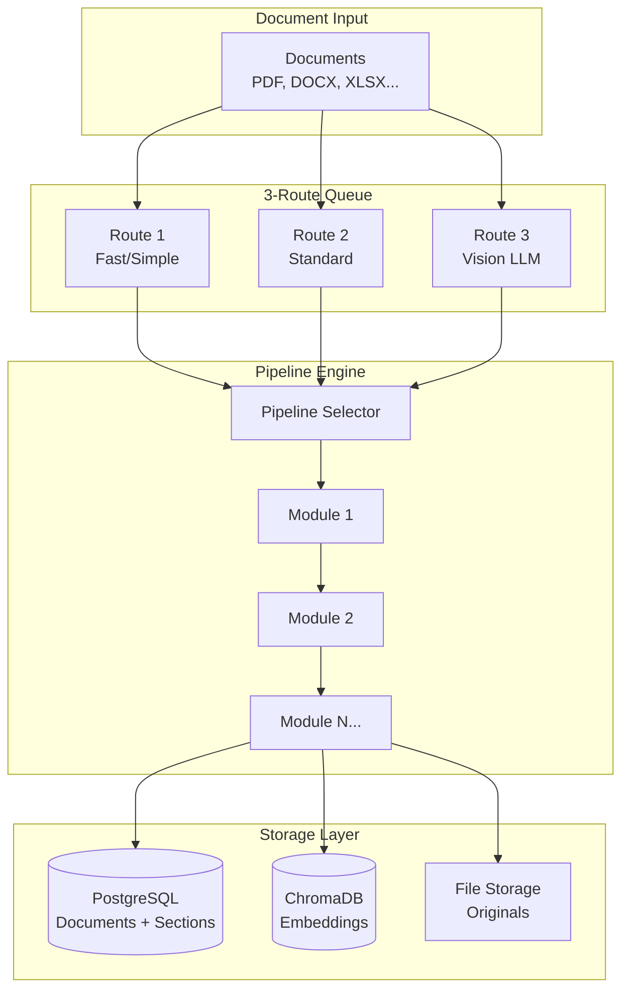
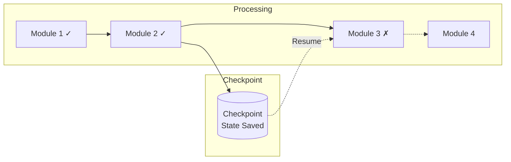

> ⚠️ **Note**: This is a personal project running on my home development servers, not a commercial system.

# 📄 Content Processor

> Modular document processing with LLM-powered extraction and vision analysis

**Home Lab Project** · **46 Modules** · **24 Pipelines** · **8 Content Types**


---

## The Problem

Getting clean, structured data from documents is surprisingly hard:

- **Format chaos** - PDFs, Word docs, Excel, PowerPoint, emails, images...
- **Layout matters** - Tables, headers, and structure get lost in extraction
- **One-size-fits-none** - Different documents need different processing
- **No memory** - Process fails halfway? Start over.

I needed a system that could handle any document type, preserve structure, and pick up where it left off if something went wrong.

---

## The Solution

**Content Processor** is a modular pipeline system where you compose processing steps like building blocks. Each module does one thing well, and pipelines chain them together.

```json
{
  "name": "invoice_optimized",
  "modules": [
    "pdf_text_extractor",
    "invoice_header_extractor",
    "invoice_table_extractor",
    "coordinate_aware_table_parser",
    "invoice_markdown_formatter",
    "chunk_embedder"
  ]
}
```

---

## Key Features

- 📦 **46 Processing Modules** - Extractors, parsers, formatters, validators
- 🔗 **24 Pre-built Pipelines** - Invoice, report, email, image processing
- 🎯 **3-Route Queue System** - Priority processing with worker pools
- 👁️ **Vision LLM Integration** - Layout analysis for complex documents
- 💾 **Checkpoint System** - Resume from any step after failures
- 📊 **Provenance Tracking** - Know where every piece of data came from
- 🔍 **Auto-Embedding** - Chunks go straight to ChromaDB for search

---

## Architecture



### 3-Route Queue System

| Route | Purpose | Use Case |
|-------|---------|----------|
| **Route 1** | Fast processing | Text-only, simple extraction |
| **Route 2** | Standard processing | Most documents, full pipeline |
| **Route 3** | Vision LLM | Complex layouts, tables, forms |

Documents are classified and routed automatically based on content type and complexity.

---

## Supported Content Types

| Type | Extractor | Special Features |
|------|-----------|------------------|
| **PDF** | `pdf_text_extractor` | Vision fallback for scanned docs |
| **DOCX** | `docx_extractor` | Embedded images, styles |
| **XLSX** | `xlsx_extractor` | Multi-sheet, formulas |
| **PPTX** | `pptx_extractor` | Slide structure |
| **EML/MSG** | `eml_extractor`, `msg_extractor` | Attachments, threading |
| **RTF** | `rtf_extractor` | Legacy format support |
| **Images** | `image_extractor` | OCR via Vision LLM |
| **HTML** | `markdown_generator` | Clean text extraction |

---

## Module Categories


### Key Modules

| Module | Purpose |
|--------|---------|
| `vision_layout_analyzer` | LLM-powered layout understanding |
| `coordinate_aware_table_parser` | Preserves table structure with coordinates |
| `hierarchical_document_parser` | Extracts document hierarchy (H1→H2→H3) |
| `section_extractor_module` | Splits into logical sections |
| `chunk_embedder` | Creates embeddings for semantic search |
| `provenance_tracking_module` | Tracks data lineage |

---

## Example Pipelines

### Invoice Processing


Extracts vendor, dates, line items, totals with full table structure preservation.

### Vision-Guided Extraction

For complex layouts where text extraction fails:


Uses Valet Visual to understand page layout before extraction.

---

## Web UIs

The service includes several browser-based interfaces:

| UI | Purpose |
|----|---------|
| **Admin** | Document management, queue status |
| **Workbench** | Test modules interactively |
| **Vision Workbench** | Vision LLM testing |
| **Registry** | Document type configuration |

---

## Checkpoint System

Processing can resume from any module if interrupted:



Each module's output is checkpointed to disk, enabling:
- Resume after crashes
- Reprocess from any step
- Debugging intermediate states

---

## Stats (My Instance)

| Metric | Value |
|--------|-------|
| Documents Processed | 259 |
| Sections Extracted | 7,396 |
| Embeddings Created | 26,409 |
| Pipeline Configs | 24 |
| Processing Modules | 46 |

---

## Tech Stack

| Component | Technology | Why |
|-----------|------------|-----|
| **API** | FastAPI | Async, OpenAPI docs |
| **Database** | PostgreSQL | Documents, sections, metadata |
| **Vectors** | ChromaDB | Semantic search |
| **Vision** | Valet Visual | Layout analysis |
| **LLM** | Valet Runtime | Extraction, classification |
| **Queue** | Custom 3-route | Priority processing |
| **UI** | Vanilla HTML/JS | Simple, no build step |

---

## What I Learned

1. **Modularity wins** - Composable modules beat monolithic processors
2. **Checkpoints are essential** - Long pipelines fail; being able to resume is critical
3. **Vision LLM is a game-changer** - Complex layouts need visual understanding
4. **Provenance matters** - Knowing where data came from enables debugging

---

## What's Next

- [ ] Streaming progress to UI
- [ ] More document type support (CAD, audio transcripts)
- [ ] Batch processing improvements
- [ ] Better table detection heuristics
