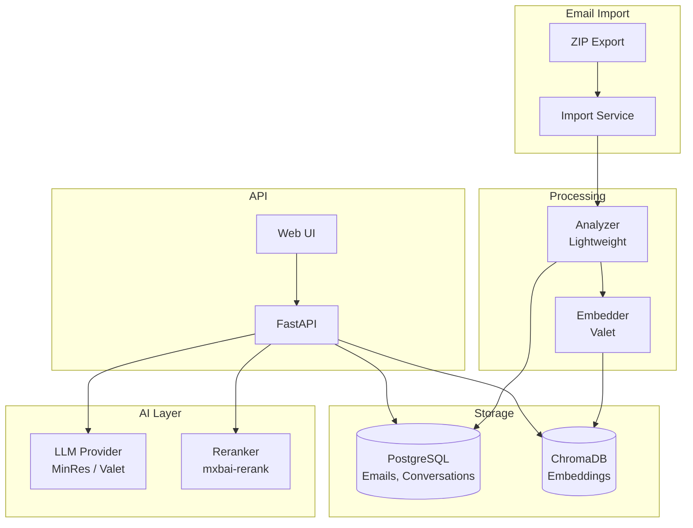
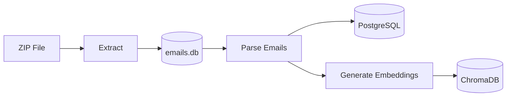
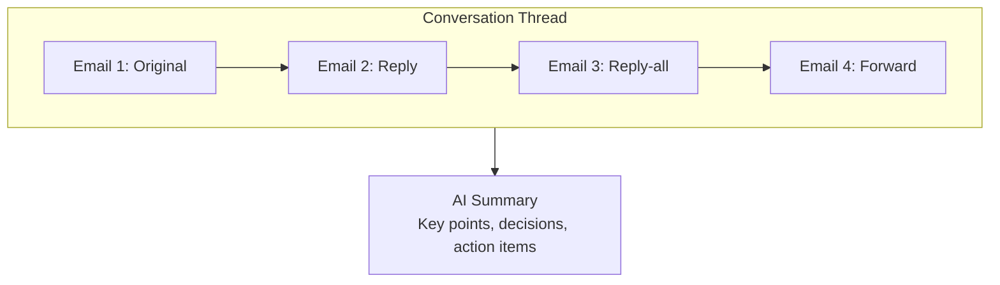
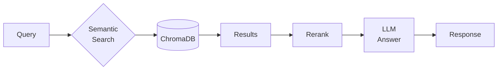

> ⚠️ **Note**: This is a personal project running on my home development servers, not a commercial system.

# 📧 Email Agent

> AI assistant for searching, summarizing, and understanding your email archive

**Home Lab Project** · **Semantic Search** · **Conversation Summaries**


---

## The Problem

Email archives are goldmines of information, but impossible to navigate:

- **Search is keyword-only** - "What did John say about the project?" returns nothing
- **No summaries** - Opening every thread to understand context
- **No patterns** - Who emails most? What topics dominate?
- **Scattered context** - Related emails buried across folders

I wanted to ask questions about my email in natural language and get intelligent answers.

---

## The Solution

**Email Agent** imports your email archive, generates semantic embeddings, and provides an AI chat interface for exploring your messages.

```
"What were the key decisions from last quarter's planning emails?"

"Find all emails where Sarah mentioned the budget"

"Summarize my conversations with the design team"
```

---

## Key Features

- 🔍 **Semantic Search** - Find emails by meaning, not just keywords
- 💬 **AI Chat** - Ask questions about your email in natural language
- 📝 **Conversation Summaries** - Auto-generated summaries per thread
- 📁 **Folder Organization** - Browse by folder with AI summaries
- 🔄 **Multi-LLM Support** - Switch between LLM providers
- 📊 **Email Analytics** - Patterns, top senders, activity over time

---

## Architecture



---

## How It Works

### 1. Import

Export your emails using a standard email exporter. Email Agent processes the ZIP:



### 2. Conversation Threading

Emails are grouped into conversations for context:



### 3. Search & Chat

Query by keywords or ask questions:



---

## API Endpoints

| Endpoint | Purpose |
|----------|---------|
| `POST /api/v1/imports` | Upload email archive |
| `GET /api/v1/emails` | List/search emails |
| `GET /api/v1/conversations` | List conversation threads |
| `POST /api/v1/ai/chat` | Chat with AI about emails |
| `POST /api/v1/ai/summarize/conversation/{id}` | Summarize a thread |
| `GET /api/v1/search` | Semantic search |
| `GET /api/v1/folders` | Browse by folder |

---

## AI Capabilities

### Chat Assistant

Ask questions about your email archive:

```json
{
  "message": "What did Sarah say about the Q3 budget?",
  "context_emails": 10
}
```

Response includes relevant emails and a synthesized answer.

### Conversation Summaries

Each thread gets an AI-generated summary:

- **Key points** discussed
- **Decisions** made
- **Action items** identified
- **Participants** involved

### Folder Summaries

Folders can be summarized to understand their contents at a glance.

---

## Multi-LLM Support

Switch between providers based on task:

| Provider | Use Case |
|----------|----------|
| **MinRes** | Primary, fast responses |
| **Valet** | Fallback, more models available |

```python
# Override per-request
response = await chat(
    request={"message": "..."},
    provider="valet"  # or "minres"
)
```

---

## Tech Stack

| Component | Technology |
|-----------|------------|
| **API** | FastAPI |
| **Database** | PostgreSQL |
| **Vectors** | ChromaDB |
| **Embeddings** | Valet (mxbai-embed) |
| **Reranking** | Valet (mxbai-rerank) |
| **LLM** | Multi-provider support |
| **UI** | Web interface |

---

## Privacy Note

This runs entirely on my local servers. Emails never leave my network. The LLMs are either local (via Valet) or privacy-focused providers.

---

## What I Learned

1. **Semantic search transforms email** - Finding by meaning is a game-changer
2. **Conversation threading matters** - Context comes from the thread, not individual emails
3. **Summaries save time** - A good summary beats reading 20 emails
4. **Embeddings need tuning** - Chunk size and overlap affect search quality

---

## What's Next

- [ ] Real-time sync with email providers
- [ ] Better attachment handling
- [ ] Email drafting with AI
- [ ] Calendar integration for meeting emails
