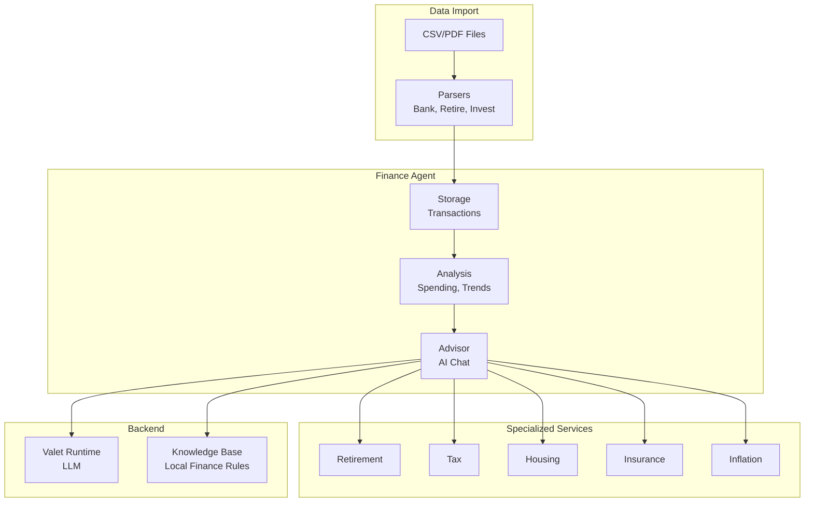
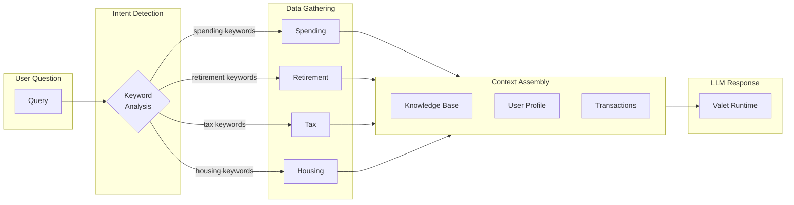

> ⚠️ **Note**: This is a personal project running on my home development servers. It processes my own financial data and is not intended for public use.

# 💰 Fin Agent

> AI-powered personal finance management with conversational insights

**Home Lab Project** · **Multi-Bank Import** · **Financial Advisor Chat**

---

## The Problem

Personal finance is fragmented and hard to analyze:

- **Multiple accounts** - Credit cards, savings, retirement, investments across institutions
- **No unified view** - Each bank has its own app, its own categories
- **Shallow insights** - Bank apps show spending, not strategy
- **No forecasting** - What does my retirement look like? How does inflation affect me?

I wanted a single system that could import all my transactions, understand my finances holistically, and answer questions like a financial advisor.

---

## The Solution

**Fin Agent** imports transactions from multiple banks, normalizes them into a unified format, and provides an AI-powered conversational interface for financial analysis.

```
"How much did I spend on groceries last quarter?"

"What's my projected retirement balance at 60?"

"How does my spending compare month over month?"

"What should I do with my savings right now?"
```

---

## Key Features

- 📥 **Multi-Source Import** - Banks, retirement accounts, investment platforms
- 💬 **AI Financial Advisor** - Conversational insights via Valet LLM
- 📊 **Spending Analysis** - Category breakdown, trends, comparisons
- 🏦 **Retirement Planning** - Retirement account projections, withdrawal strategies
- 💸 **Tax Optimization** - Bracket calculations, deduction opportunities
- 🏠 **Housing Analysis** - Rent vs buy, mortgage scenarios
- 🛡️ **Insurance Tracking** - Health cover, MLS implications
- 📈 **Inflation Modeling** - Future expense projections

---

## Architecture



---

## Supported Formats

| Type | Format | Data |
|------|--------|------|
| **Credit Card** | CSV | Transactions |
| **Savings Account** | CSV | Transactions |
| **Retirement Accounts** | CSV | Contributions, balance |
| **Investments** | CSV | Holdings, performance |
| **Bank Statements** | PDF | Coming soon |

Parsers normalize transactions into a standard format with categories, merchants, and amounts.

---

## The Advisor Chat

The core of Fin Agent is the conversational advisor:



The system detects what data is relevant to your question, gathers it from the appropriate services, and injects it into the LLM context.

---

## Specialized Services

### 🏖️ Retirement Service

- Retirement account projections
- Withdrawal age calculations
- Safe withdrawal rate analysis
- Contribution optimization

### 💸 Tax Service

- Tax bracket calculations
- Deduction tracking
- Estimated tax liability
- Refund projections

### 🏠 Housing Service

- Rent vs buy analysis
- Mortgage scenarios
- Stamp duty calculations
- Affordability assessments

### 🛡️ Insurance Service

- Health insurance tracking
- Healthcare levy impact
- Coverage analysis

### 📈 Inflation Service

- Future expense modeling
- Cost of living adjustments
- Retirement purchasing power

---

## Knowledge Base

The advisor is grounded in local financial knowledge:

- Retirement account rules and withdrawal ages
- Tax brackets and deductions
- Healthcare levy thresholds
- Investment principles

This prevents the LLM from hallucinating incorrect financial information.

---

## API Endpoints

| Category | Endpoints |
|----------|-----------|
| **Imports** | Upload files, list imports |
| **Accounts** | List accounts, balances |
| **Transactions** | Search, filter, categorize |
| **Analysis** | Dashboard, spending breakdown |
| **Advisor** | Chat, sessions, history |
| **Retirement** | Projections, scenarios |
| **Tax** | Calculations, estimates |
| **Housing** | Scenarios, comparisons |

---

## Tech Stack

| Component | Technology |
|-----------|------------|
| **API** | FastAPI |
| **Storage** | JSON files (simple, portable) |
| **LLM** | Valet Runtime |
| **Parsers** | Custom per-institution |
| **UI** | SvelteKit dashboard |

---

## Privacy Note

This is a **personal finance tool** for my own use:

- All data stays on my local servers
- No cloud sync or external APIs (except Valet for LLM)
- Transaction data never leaves my network
- LLM queries don't include raw transaction details

---

## What I Learned

1. **Parsers are fragile** - Each bank has its own CSV format quirks
2. **Categories are hard** - Merchant names don't map cleanly to categories
3. **Context is key** - The LLM needs real data to give useful advice
4. **Knowledge grounding works** - Injecting local finance rules prevents hallucinations

---

## What's Next

- [ ] Automatic categorization via LLM
- [ ] PDF statement parsing
- [ ] Goal tracking (savings targets, debt payoff)
- [ ] Investment rebalancing suggestions
