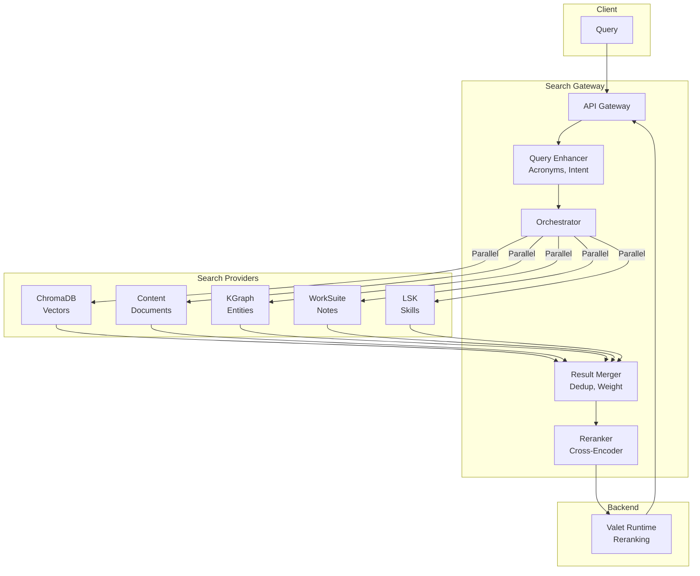
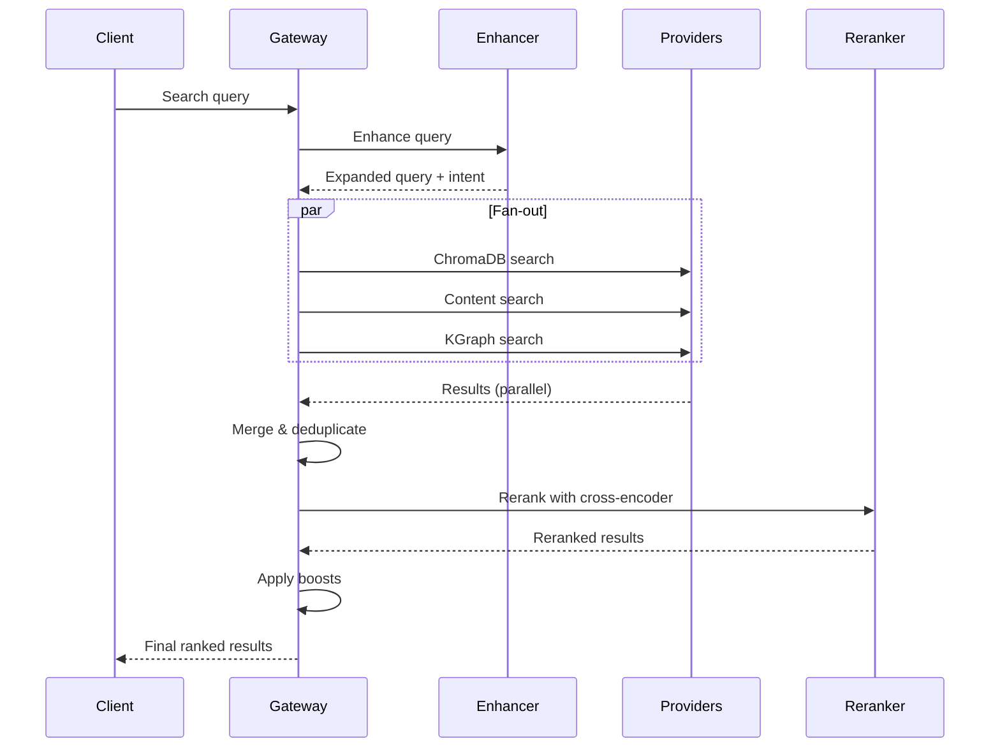
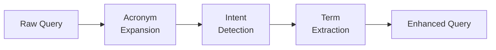
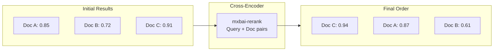
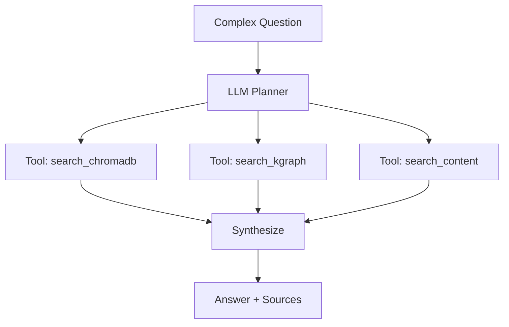

> ⚠️ **Note**: This is a personal project running on my home development servers, not a commercial system.

# 🔍 Search Gateway

> Federated search across multiple knowledge sources with AI-powered reranking

**Home Lab Project** · **5 Providers** · **AI Search Mode**

---

## The Problem

My knowledge was scattered across multiple systems:

- **ChromaDB** - Vector embeddings from documents
- **Content Processor** - Extracted sections and metadata
- **Knowledge Graph** - Entities and relationships
- **Work Suite** - Notes and tasks
- **Skills (LSK)** - Structured knowledge units

Each had its own search API. Finding something meant checking multiple places and mentally merging results.

---

## The Solution

**Search Gateway** federates search across all providers, merges results intelligently, and reranks using a cross-encoder model.

One query → all sources → unified, ranked results.

```bash
curl -X POST http://localhost:8700/api/v1/search \
  -H "Content-Type: application/json" \
  -d '{"query": "how does the agent memory system work?"}'
```

Returns results from all providers, deduplicated and ranked by relevance.

---

## Key Features

- 🔗 **5 Search Providers** - ChromaDB, Content, KGraph, WorkSuite, LSK
- ⚡ **Parallel Fan-out** - Query all providers simultaneously
- 🎯 **Cross-Encoder Reranking** - mxbai-rerank for precise ordering
- 🧠 **AI Search Mode** - LLM-powered tool calling for complex queries
- 📊 **Query Enhancement** - Acronym expansion, intent detection
- 💾 **Saved Searches** - Save and rerun common queries
- 📈 **Analytics** - Track search patterns and performance

---

## Architecture



---

## Search Flow



---

## Providers

| Provider | Source | What It Searches |
|----------|--------|------------------|
| **ChromaDB** | Vector store | Semantic similarity on embeddings |
| **Content** | Content Processor | Documents, sections, metadata |
| **KGraph** | Knowledge Graph | Entities, relationships, facts |
| **WorkSuite** | Work Suite | Notes, tasks, bookmarks |
| **LSK** | Skills Registry | Structured knowledge units |

Each provider returns results in a standardized format with scores. The gateway handles the translation.

---

## Query Enhancement

Before searching, queries are enhanced:



- **Acronym Expansion**: "API" → "Application Programming Interface"
- **Intent Detection**: Categorize as lookup, comparison, how-to, etc.
- **Term Extraction**: Identify key entities and concepts

---

## Reranking

Initial results are scored by each provider, but these scores aren't comparable. The gateway uses a cross-encoder to rerank:



The cross-encoder considers both query and document text together, producing more accurate relevance scores.

---

## AI Search Mode

For complex questions, AI Search uses LLM tool calling:

```json
{
  "query": "Compare the memory systems in Agent Platform vs Content Processor",
  "max_tool_calls": 5,
  "include_tool_trace": true
}
```

The LLM decides which searches to run, synthesizes results, and generates an answer with citations:



Includes:
- **Tool trace**: See exactly which searches were run
- **Source citations**: Links back to original documents
- **Confidence scoring**: How certain the answer is

---

## Caching

Results are cached to reduce load:

| Cache Type | TTL | Purpose |
|------------|-----|---------|
| Query results | 5 min | Avoid repeated searches |
| Provider status | 30 sec | Health check caching |
| Rerank results | 10 min | Expensive cross-encoder calls |

---

## Tech Stack

| Component | Technology | Why |
|-----------|------------|-----|
| **API** | FastAPI | Async, streaming, OpenAPI |
| **Rate Limiting** | SlowAPI | Protect AI endpoints |
| **Reranking** | mxbai-rerank via Valet | Cross-encoder accuracy |
| **Metrics** | Prometheus | Observability |
| **WebSocket** | FastAPI WS | Real-time updates |
| **Cache** | In-memory | Fast, stateless |

---

## What I Learned

1. **Federation is powerful** - Unified search across silos is a game-changer
2. **Reranking matters** - Cross-encoders dramatically improve result quality
3. **Parallel is fast** - Fan-out queries hide individual provider latency
4. **Intent helps** - Knowing what kind of answer users want improves relevance

---

## What's Next

- [ ] Hybrid search (keyword + semantic)
- [ ] Query suggestions / autocomplete
- [ ] Search history and personalization
- [ ] More provider integrations
