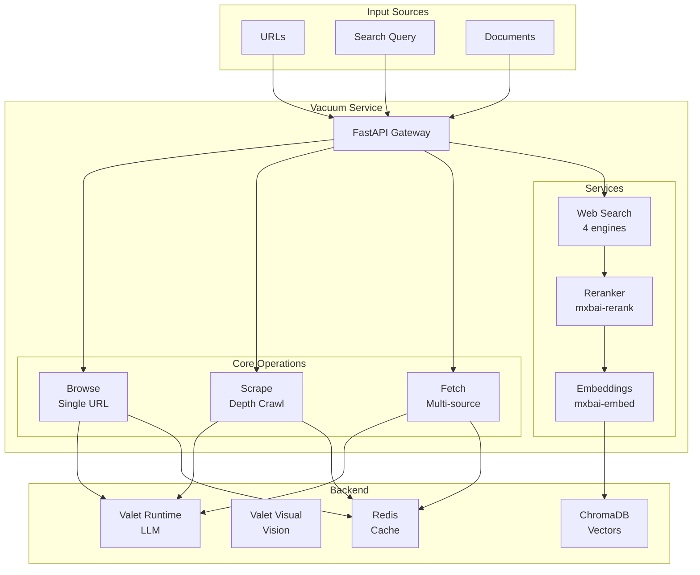
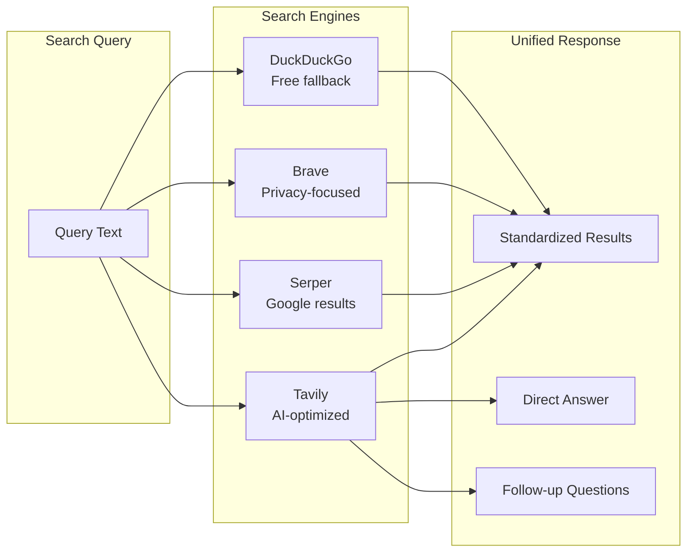
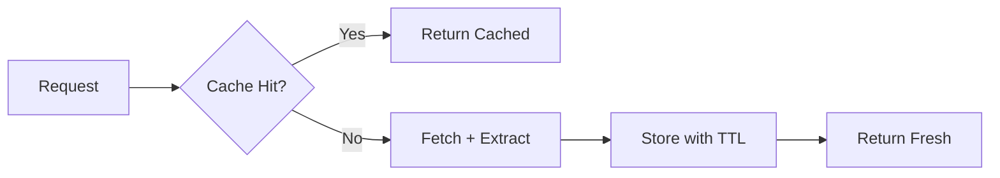

> ⚠️ **Note**: This is a personal project running on my home development servers, not a commercial system.

# 🌀 Vacuum

> LLM-powered web content extraction and knowledge ingestion

**Home Lab Project** · **4 Search Engines** · **Plugin Architecture**

---

## The Problem

I needed to feed my AI agents with fresh, structured knowledge from the web:

- **Raw HTML is useless** - LLMs need clean, extracted content
- **Web scraping is brittle** - Selectors break when sites change
- **Search is fragmented** - Different APIs, different formats
- **No memory** - Every scrape starts from scratch

Traditional scrapers return HTML soup. I wanted a system that could understand pages, extract the relevant parts, and store them for retrieval.

---

## The Solution

**Vacuum** uses LLMs to intelligently extract content from web pages. Instead of CSS selectors, you describe what you want in natural language, and the LLM figures out how to get it.

```python
# Traditional scraping (fragile)
title = soup.select_one("h1.article-title").text
content = soup.select_one("div.content-body").text

# Vacuum (intelligent)
result = await vacuum.browse(
    url="https://example.com/article",
    prompt="Extract the article title, author, date, and main content"
)
# Returns structured JSON with exactly what you asked for
```

---

## Key Features

- 🧠 **LLM-Powered Extraction** - Uses ScrapeGraphAI with Valet Runtime
- 🔍 **Multi-Engine Search** - Tavily, Serper, Brave, DuckDuckGo in one API
- 📦 **Smart Caching** - TTL strategies by content type (news vs docs)
- 🎯 **Reranking** - Reorder results by relevance using mxbai-rerank
- 🖼️ **Visual Analysis** - Extract content from images via Valet Visual
- 🔌 **Plugin System** - Add custom content sources
- 💾 **Vector Storage** - ChromaDB for semantic search

---

## Architecture



---

## Core Operations

### Browse - Single URL Extraction

Extract structured content from a single page:

```bash
curl -X POST http://localhost:8500/browse \
  -H "Content-Type: application/json" \
  -d '{
    "url": "https://docs.python.org/3/library/asyncio.html",
    "prompt": "Extract the main concepts and code examples"
  }'
```

### Scrape - Depth Crawling

Crawl a site to a specified depth:

```bash
curl -X POST http://localhost:8500/scrape \
  -H "Content-Type: application/json" \
  -d '{
    "url": "https://fastapi.tiangolo.com/",
    "prompt": "Extract all tutorial content",
    "depth": 2
  }'
```

### Fetch - Multi-Source Retrieval

Gather content from multiple URLs in parallel:

```bash
curl -X POST http://localhost:8500/fetch \
  -H "Content-Type: application/json" \
  -d '{
    "urls": ["https://a.com", "https://b.com", "https://c.com"],
    "prompt": "Summarize the main points"
  }'
```

---

## Web Search Integration

Vacuum provides a unified search API across multiple engines:



| Engine | Best For | API Key Required |
|--------|----------|------------------|
| **Tavily** | AI applications, returns clean content | Yes |
| **Serper** | Google search results | Yes |
| **Brave** | Privacy, no tracking | Yes |
| **DuckDuckGo** | Free fallback, no key needed | No |

The system uses **auto mode** by default, selecting the best available engine based on your API keys.

---

## Caching Strategy

Different content types have different freshness requirements:

| Content Type | TTL | Rationale |
|--------------|-----|-----------|
| Documentation | 24 hours | Changes infrequently |
| News | 30 minutes | Stale quickly |
| Social | 5 minutes | Real-time content |
| Default | 1 hour | Balance freshness/performance |

Cache is stored in Redis with automatic expiration:



---

## Plugin System

Extend Vacuum with custom content sources:

### Creating a Plugin

```python
from vacuum.plugins.base import BasePlugin, PluginMetadata

class MyPlugin(BasePlugin):
    @classmethod
    def metadata(cls) -> PluginMetadata:
        return PluginMetadata(
            name="my-plugin",
            version="1.0.0",
            description="Custom content source"
        )
    
    async def process(self, request):
        # Your extraction logic here
        return {"content": "..."}
```

Plugins are auto-discovered from the plugins directory and registered at startup.

---

## Tech Stack

| Component | Technology | Why |
|-----------|------------|-----|
| **API** | FastAPI | Async, fast, OpenAPI docs |
| **Extraction** | ScrapeGraphAI | LLM-powered scraping |
| **LLM** | Valet Runtime | Unified model access |
| **Vision** | Valet Visual | Image extraction |
| **Cache** | Redis | Fast, TTL support |
| **Vectors** | ChromaDB | Semantic search |
| **Reranking** | mxbai-rerank | Result relevance |

---

## What I Learned

1. **LLMs beat selectors** - Natural language extraction is more resilient than CSS selectors
2. **Caching is essential** - Web scraping without caching wastes compute and hits rate limits
3. **Multi-engine search** - No single search API is perfect; having fallbacks is crucial
4. **Plugin architecture** - Adding new sources should be easy, not a code change

---

## What's Next

- [ ] YouTube transcript extraction
- [ ] PDF ingestion pipeline
- [ ] Scheduled refresh for important sources
- [ ] Better deduplication in ChromaDB
