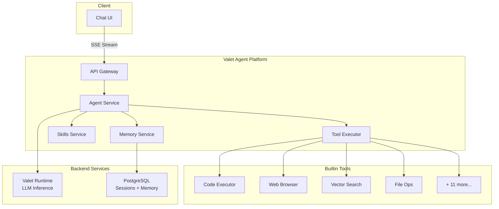
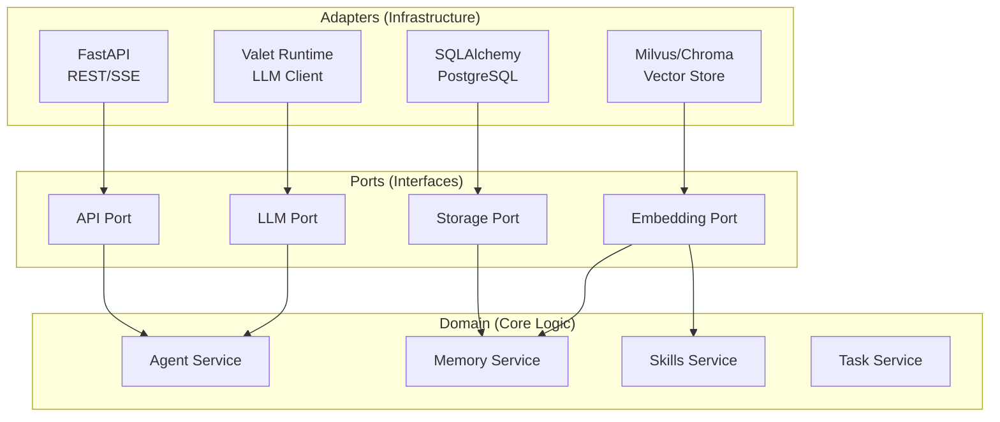
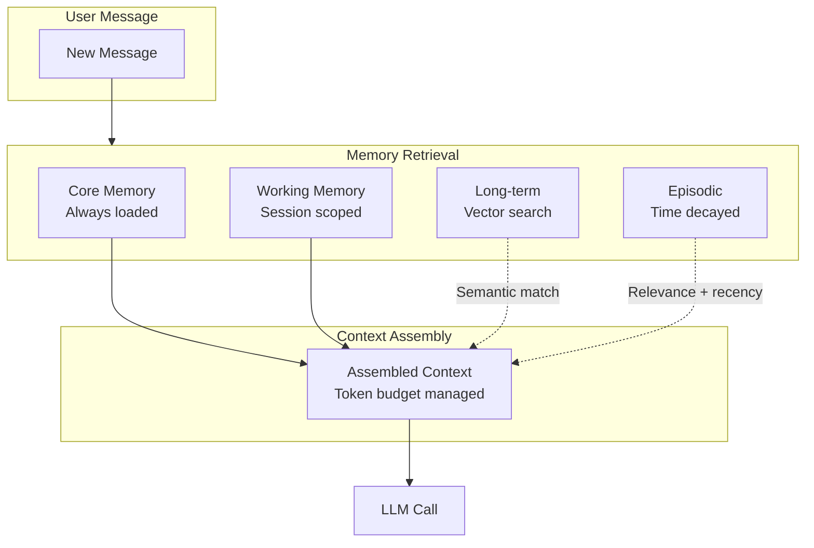
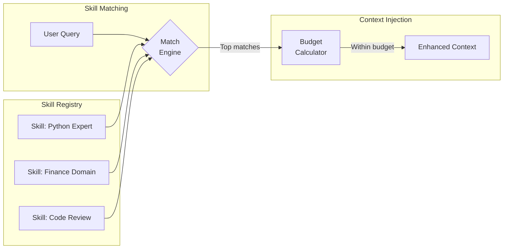
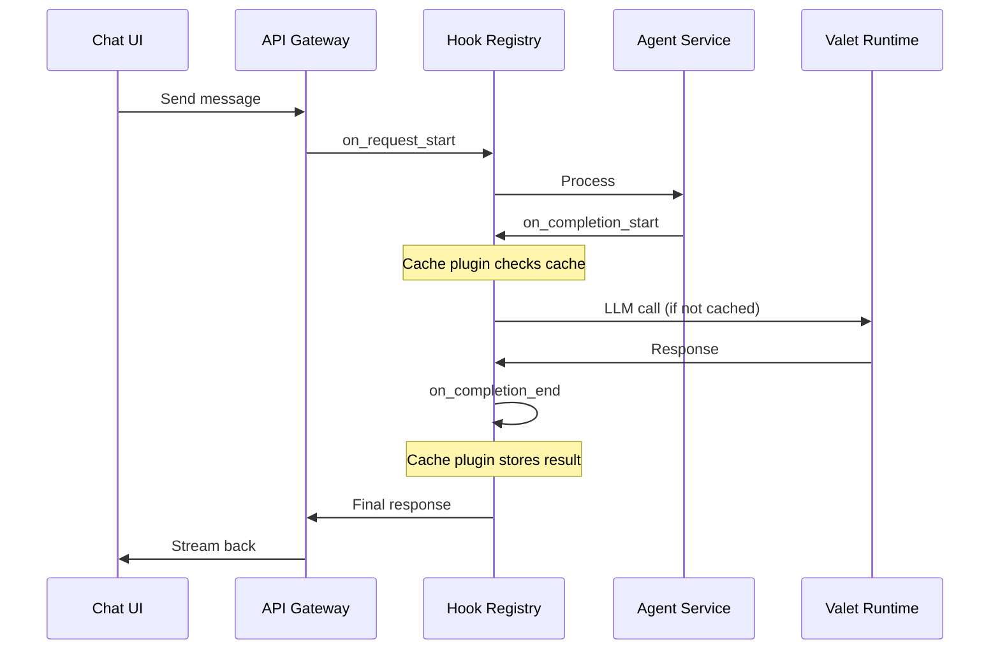

> ⚠️ **Note**: This is a personal project running on my home development servers, not a commercial system.

# 🤖 Valet Agent Platform

> A framework for building AI agents with memory, skills, and tool integration

**Home Lab Project** · **15 Builtin Tools** · **Multi-tier Memory**


---

## The Problem

Building AI agents that can actually *do things* is harder than it looks:

- **Stateless conversations** - Chat APIs don't remember context between calls
- **Tool integration** - Each tool needs its own calling convention
- **No visibility** - What is the agent doing right now?
- **Fragile loops** - Agents get stuck, repeat themselves, or run forever

I wanted a platform where I could wire up tools, give the agent memory, and watch it work in real-time.

---

## The Solution

**Valet Agent Platform** is an orchestration layer that sits between your UI and the LLM. It handles sessions, memory, tool execution, and streams progress back to you.

```python
# Simple agent interaction
async with agent.session(user_id="ben") as session:
    response = await session.send("Analyze my recent expenses")
    
    # Watch tools execute in real-time
    async for event in response.stream():
        if event.type == "tool_start":
            print(f"Running: {event.tool_name}")
        elif event.type == "content":
            print(event.delta, end="")
```

---

## Key Features

- 🧠 **Multi-tier Memory** - Core facts, working context, and long-term storage
- 🔧 **15 Builtin Tools** - Web browsing, code execution, file ops, vector search, and more
- 📺 **Real-time Streaming** - Cursor-like progress events show what the agent is doing
- 📋 **Task Planning** - Agents create and execute step-by-step plans
- 🔌 **Plugin System** - Add caching, rate limiting, metrics, autonomous mode
- 💾 **Persistent Sessions** - Pick up conversations where you left off

---

## Architecture



### Hexagonal Architecture

The platform uses a **hexagonal (ports & adapters) architecture**:



- **Domain**: Pure business logic with no I/O dependencies
- **Ports**: Abstract interfaces for external services
- **Adapters**: Concrete implementations (PostgreSQL, FastAPI, etc.)

This means I can swap PostgreSQL for SQLite for testing, or replace Valet Runtime with a mock—all without touching domain code.

---

## Builtin Tools

| Tool | What It Does |
|------|--------------|
| `code_executor` | Run Python/JS in a sandboxed environment |
| `web_browser` | Browse and extract content from web pages |
| `vector_search` | Semantic search across indexed documents |
| `knowledge_graph` | Query and update the knowledge graph |
| `file_ops` | Read, write, and manage files |
| `content_processor` | Process documents through the ingestion pipeline |
| `fin_agent` | Personal finance queries and analysis |
| `calculator` | Mathematical calculations |
| `image_gallery` | Manage and search images |
| `graph_query` | Execute graph database queries |
| `worksuite` | Integration with Work Suite tools |
| + 4 more | Context info, DOCeater, and utilities |

---

## Chat UI

The platform includes a SvelteKit-based chat interface for interacting with agents:


*Chat interface showing real-time tool execution and streaming responses*

---

## Memory System

The agent has four tiers of memory, each with different persistence and decay characteristics:



| Tier | Persistence | Decay | Use Case |
|------|-------------|-------|----------|
| **Core** | Permanent | None | User identity, preferences, key facts |
| **Working** | Session | Cleared on end | Current task context, tool results |
| **Long-term** | Permanent | Slow | Conversation history, retrieved semantically |
| **Episodic** | Permanent | Time-based | Session events, fades over time |

Memory retrieval is **budget-aware** - the system calculates how many tokens can be injected based on the model's context window (using the 25% rule from LSK principles).

---

## Skills System (LSK)

Skills are structured knowledge units that enhance agent capabilities:



- Skills are registered with **activation patterns** (keywords, semantic similarity)
- The system **dynamically calculates token budgets** based on model context windows
- Skills inject expert knowledge, procedures, and examples into the prompt
- Usage is tracked for analytics and optimization

---

## Real-time Progress

Unlike typical chat APIs, Valet streams *what the agent is doing*, not just the final text:

```json
{"type": "thinking", "content": "Analyzing the request..."}
{"type": "plan", "steps": [{"step": 1, "description": "Search expenses"}]}
{"type": "tool_start", "tool": "fin_agent", "args": {"query": "expenses"}}
{"type": "tool_complete", "tool": "fin_agent", "result": "..."}
{"type": "content", "delta": "Based on your recent expenses..."}
{"type": "complete", "usage": {"tokens": 1247}}
```

Your UI can show progress bars, tool execution status, and partial responses as they happen.

---

## Tech Stack

| Component | Technology | Why |
|-----------|------------|-----|
| **API** | FastAPI | Async, streaming, OpenAPI |
| **Storage** | SQLAlchemy 2.0 + PostgreSQL | ORM with type safety |
| **LLM** | Valet Runtime | Unified gateway (see other post) |
| **Events** | HookRegistry | Plugin extensibility |
| **Streaming** | SSE | Real-time progress |

---

## Plugin System

The platform is designed around a **hook registry** that allows plugins to intercept and modify behavior at key points:



```python
# Example: Add caching to all LLM calls
class CachePlugin(Plugin):
    async def on_completion_start(self, params):
        cached = await self.cache.get(params.hash)
        if cached:
            return cached  # Skip LLM call
    
    async def on_completion_end(self, params, result):
        await self.cache.set(params.hash, result)
```

### Available Plugins

| Plugin | Purpose |
|--------|---------|
| **Cache** | Avoid redundant LLM calls |
| **Rate Limit** | Per-client request throttling |
| **Metrics** | Prometheus-compatible metrics |
| **Logging** | Structured request logging |
| **Propulsion** | Auto-resume pending work |
| **Autonomous** | Goal-driven multi-step execution |

### Propulsion: Auto-Resume

The **Propulsion Plugin** implements a simple but powerful principle:

> *"If your hook has work, RUN IT."*

On startup, the platform scans for paused or pending workflows and automatically resumes them. This means:
- Interrupted tasks pick up where they left off
- No orphaned sessions
- Resilience to restarts

---

## What I Learned

Building this taught me:

1. **Memory is key** - Agents without memory feel broken; users expect continuity
2. **Visibility matters** - Showing tool execution builds trust and helps debugging
3. **Hexagonal works** - Clean separation makes testing and swapping backends easy
4. **Streaming is hard** - SSE with partial JSON requires careful buffering

---

## What's Next

- [ ] More tool integrations (email, calendar)
- [ ] Multi-agent orchestration
- [ ] Better autonomous mode with goals
- [ ] Improved memory retrieval (hybrid search)
