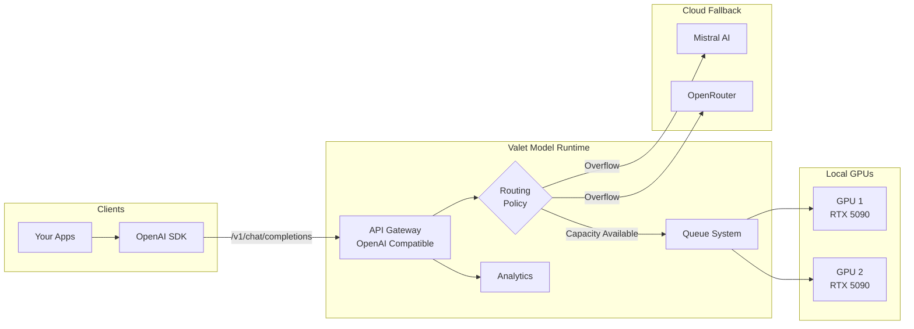

# 🚀 Valet Model Runtime

> A drop-in OpenAI replacement that routes between local GPUs and cloud APIs

**Status**: Production · **GPUs**: 2× RTX 5090 · **Throughput**: 1,320 req/s

---

## The Problem

Running local LLMs sounds great until you try to do it at scale:

- **VRAM conflicts** - Multiple services fighting over GPU memory
- **No visibility** - Which service used how many tokens?
- **No fallback** - Local GPU busy = requests fail
- **API fragmentation** - Different APIs for Ollama, OpenAI, Anthropic

I was running multiple AI services that all needed LLM access. Each had its own connection to Ollama, leading to constant VRAM conflicts and no way to track usage.

---

## The Solution

**Valet Model Runtime** is a unified gateway that presents an OpenAI-compatible API while handling all the complexity behind the scenes.

Point your apps at Valet instead of OpenAI. Same SDK, same API, but now you control the infrastructure.

```python
# Before: Direct to OpenAI
client = OpenAI(api_key="sk-...")

# After: Through Valet (same code!)
client = OpenAI(
    base_url="http://valet:9300/v1",
    api_key="not-needed"
)
```

---

## Key Features

- 🔌 **OpenAI Compatible** - Use existing code unchanged, just change the base URL
- ⚡ **Multi-GPU Load Balancing** - Distribute requests across multiple GPUs with round-robin or capacity-based routing
- ☁️ **Cloud Overflow** - Automatic failover to Mistral AI, OpenRouter when local capacity is exhausted
- 👁️ **Vision Support** - OpenAI vision format with automatic image handling
- 📊 **PostgreSQL Analytics** - Request logging, token tracking, full-text search
- 🔄 **Rate Limiting** - Per-client, per-queue with RPM and concurrent limits
- 📈 **Prometheus Metrics** - Full observability at `/metrics`

---

## Architecture



The gateway receives OpenAI-formatted requests, decides whether to route locally or to cloud based on current GPU capacity, and returns responses in OpenAI format. Your code never knows the difference.

---

## Performance

Measured on NVIDIA RTX 5090 (32GB VRAM):

| Metric | Performance |
|--------|-------------|
| **API Throughput** | 1,320 req/s |
| **LLM Inference** | 11.2 req/s @ 525 tok/s |
| **Embeddings** | 2,974 emb/s (batch 64) |
| **Time to First Token** | 70ms |
| **Success Rate** | 100% |

The gateway itself adds minimal overhead. Most latency is in the LLM inference itself.

---

## Tech Stack

| Component | Technology | Why |
|-----------|------------|-----|
| **API** | FastAPI + Gunicorn | Async, multi-worker, OpenAPI docs |
| **High-Perf Routes** | Go | Streaming, token counting at speed |
| **LLM Runtime** | Ollama | Simple, GPU-optimized |
| **State/Cache** | Redis | Request queuing, rate limits |
| **Analytics** | PostgreSQL | Durable logging, FTS |
| **Admin UI** | SvelteKit | Modern, fast dashboard |
| **Container** | Docker | Single-container deployment |

---

## Production Setup

Currently running a two-node cluster:

| Node | Role | Hardware | VRAM |
|------|------|----------|------|
| **seed** | Gateway + Worker | RTX 5090 | 32GB |
| **sapling** | Worker | RTX 5090 | 32GB |

Cloud overflow routes to Mistral AI and OpenRouter in round-robin when local capacity is full. This gives me 128k context windows when needed without keeping large models loaded locally.

---

## What I Learned

Building this taught me a lot about LLM infrastructure:

1. **The LLM is the easy part** - Request routing, failure handling, and observability are where the complexity lives
2. **VRAM management is tricky** - Models don't unload cleanly; nvidia-smi verification is essential
3. **Streaming needs special handling** - Can't use standard HTTP middleware for SSE
4. **Rate limiting is subtle** - Per-client, per-model, RPM vs TPM vs concurrent

---

## What's Next

- [ ] Open-source release (cleaning credentials)
- [ ] Kubernetes Helm chart
- [ ] More cloud provider integrations
- [ ] Cost tracking and budgets
