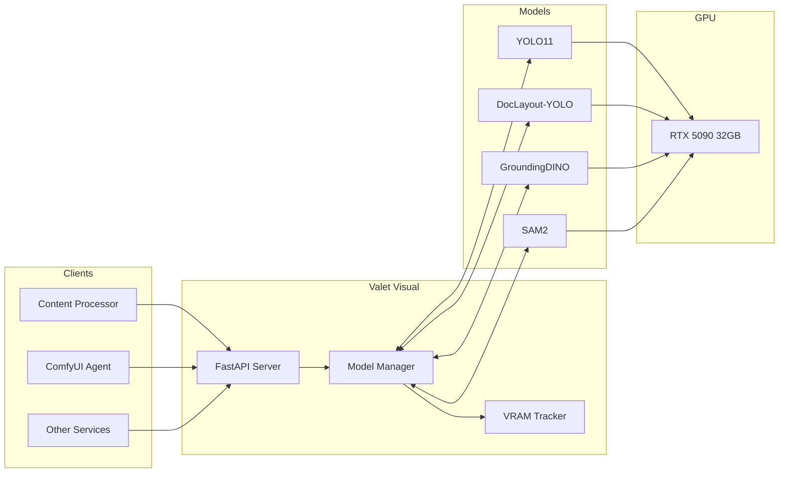

# 👁️ Valet Visual

> One API for object detection, document layout, and segmentation

**Home Lab Project** · **10 Models** · **Dynamic VRAM Management** · **Service Profiles**

---

## > The Problem

Computer vision has many specialized models, each with its own API:

- **YOLO** for fast object detection
- **SAM2** for segmentation
- **GroundingDINO** for open-vocabulary detection
- **DocLayout-YOLO** for document analysis

Running them all simultaneously would exhaust GPU memory. Loading them on-demand adds latency. Each has a different API format.

I needed a unified service that could intelligently manage models and present a single, consistent API.

---

## > The Solution

**Valet Visual** provides a unified REST API for all computer vision tasks:

```bash
# Detect objects in an image
curl -X POST http://localhost:9400/v1/detect \
  -H "Content-Type: application/json" \
  -d '{"image_url": "https://example.com/image.jpg", "detector": "yolo11"}'

# Open-vocabulary detection
curl -X POST http://localhost:9400/v1/detect \
  -d '{"image_url": "...", "detector": "grounding-dino", "prompt": "person.car.dog"}'

# Segment detected objects
curl -X POST http://localhost:9400/v1/detect \
  -d '{"image_url": "...", "detector": "yolo11", "segment": true, "segmenter": "sam2"}'
```

The service dynamically loads/unloads models based on requests and available VRAM.

---

## > Key Features

- 🎯 **Unified API** - One endpoint for all detection and segmentation tasks
- 🔄 **Dynamic Loading** - Models load on-demand, unload when not needed
- 📊 **VRAM Tracking** - Real-time GPU memory monitoring
- 📦 **Service Profiles** - Pre-configured model combinations for common tasks
- 🔥 **Warm Models** - Keep frequently-used models loaded
- 📄 **Document Analysis** - Specialized layout detection for PDFs
- 🖼️ **Batch Processing** - Process multiple images in one request
- 📈 **Prometheus Metrics** - Full observability at `/metrics`

---

## > Architecture



The Model Manager handles loading/unloading based on requests and available VRAM, while tracking GPU memory in real-time.

---

## > Available Models

### Detectors

| Model | VRAM | Speed | Description |
|-------|------|-------|-------------|
| **yolo11** | 500MB | Fast | 80 COCO classes |
| **yolo11-seg** | 600MB | Fast | YOLO11 + instance segmentation |
| **doclayout** | 800MB | Fast | Document layout (11 classes: Table, Figure, Text...) |
| **yolo-world** | 1.5GB | Medium | Open vocabulary via text prompts |
| **grounding-dino** | 1.5GB | Medium | Open vocabulary, high accuracy |

### Segmenters

| Model | VRAM | Speed | Description |
|-------|------|-------|-------------|
| **sam2** | 2.5GB | Fast | SAM2.1-hiera-large, video support |
| **sam2-base** | 1.5GB | Fast | SAM2.1-hiera-base-plus |
| **sam-base** | 1.5GB | Fast | Original SAM base |
| **sam-large** | 2.5GB | Medium | Original SAM large |
| **sam3** | 2GB | Fast | Segment Anything 3 (requires approval) |

---

## > Service Profiles

Pre-configured model combinations for common use cases:

| Profile | Models | VRAM | Use Case |
|---------|--------|------|----------|
| `none` | - | 0 | Standby mode |
| `minimal` | yolo11 | 500MB | Basic detection |
| `document` | doclayout | 800MB | PDF layout analysis |
| `document-segment` | doclayout + sam-base | 2.3GB | Document element extraction |
| `open-vocab-fast` | yolo-world | 1.5GB | Custom class detection |
| `open-vocab-precise` | grounding-dino | 2GB | High accuracy detection |
| `grounded-sam2` | grounding-dino + sam2 | 4GB | Detection + segmentation |

Apply a profile with:

```bash
curl -X POST http://localhost:9400/v1/profiles/document-segment/apply
```

---

## > API Endpoints

| Endpoint | Method | Description |
|----------|--------|-------------|
| `/v1/detect` | POST | Universal detection (JSON body) |
| `/v1/detect/upload` | POST | Detection with file upload |
| `/v1/detect/batch` | POST | Batch image detection |
| `/v1/segment` | POST | Standalone segmentation |
| `/v1/segment/upload` | POST | Segmentation with file upload |
| `/v1/document/analyze` | POST | Document layout analysis |
| `/v1/models` | GET | List all models and status |
| `/v1/models/{id}/load` | POST | Load a specific model |
| `/v1/models/{id}/unload` | POST | Unload a specific model |
| `/v1/profiles` | GET | List available profiles |
| `/v1/profiles/{name}/apply` | POST | Apply a service profile |
| `/v1/gpu` | GET | GPU status and VRAM |
| `/metrics` | GET | Prometheus metrics |

---

## > Detection Request

```json
{
  "image_url": "https://example.com/image.jpg",
  "detector": "yolo11",
  "confidence": 0.25,
  "segment": true,
  "segmenter": "sam2",
  "output_format": "masks",
  "return_visualization": true,
  "return_cropped": false
}
```

### Response

```json
{
  "success": true,
  "detector": "yolo11",
  "segmenter": "sam2",
  "processing_time_ms": 127.5,
  "image_size": [1920, 1080],
  "detection_count": 5,
  "detections": [
    {
      "label": "person",
      "confidence": 0.92,
      "bbox": [100, 200, 300, 500],
      "class_id": 0,
      "mask": "base64...",
      "area": 45000
    }
  ],
  "visualization": "base64..."
}
```

---

## > Document Layout Classes

The `doclayout` detector identifies 11 document elements:

| Class | Description |
|-------|-------------|
| `Text` | Body text paragraphs |
| `Title` | Document/section titles |
| `Figure` | Images, charts, diagrams |
| `Figure_Caption` | Figure captions |
| `Table` | Tables |
| `Table_Caption` | Table captions |
| `Header` | Page headers |
| `Footer` | Page footers |
| `Page_Number` | Page numbers |
| `Formula` | Mathematical formulas |
| `List` | Bulleted/numbered lists |

---

## > VRAM Management

The service tracks GPU memory in real-time:

```bash
curl http://localhost:9400/v1/gpu
```

```json
{
  "gpu_available": true,
  "gpu_name": "NVIDIA GeForce RTX 5090",
  "vram_total_mb": 32111,
  "vram_allocated_mb": 2500,
  "vram_free_mb": 29611,
  "models_loaded": {
    "grounding-dino": {"vram_mb": 1500, "loaded_at": "..."},
    "sam2": {"vram_mb": 2500, "loaded_at": "..."}
  },
  "can_load": ["yolo11", "doclayout", "yolo-world", "sam2-base"]
}
```

Models are automatically unloaded when VRAM is needed for higher-priority requests.

---

## > Integration Example

Used by Content Processor for document analysis:

```python
import httpx

async def analyze_document_page(image_bytes: bytes) -> dict:
    """Extract layout elements from a document page."""
    async with httpx.AsyncClient() as client:
        response = await client.post(
            "http://valet-visual:9400/v1/document/analyze",
            files={"file": ("page.png", image_bytes, "image/png")},
            data={"segment": "true"}
        )
        return response.json()

# Returns detected tables, figures, text regions with masks
```

---

## > Tech Stack

| Component | Technology | Why |
|-----------|------------|-----|
| **API** | FastAPI | Async, automatic OpenAPI docs |
| **Object Detection** | Ultralytics YOLO11 | Fast, accurate, well-maintained |
| **Document Layout** | DocLayout-YOLO | Specialized for documents |
| **Open Vocabulary** | GroundingDINO | Text-guided detection |
| **Segmentation** | SAM2 (HuggingFace) | State-of-the-art masks |
| **GPU** | CUDA + PyTorch | GPU acceleration |
| **Metrics** | Prometheus | Observability |
| **Container** | Docker + NVIDIA runtime | GPU passthrough |

---

## > Current Status

| Metric | Value |
|--------|-------|
| **GPU** | RTX 5090 (32GB VRAM) |
| **Available Models** | 10 |
| **Service Profiles** | 7 |
| **Port** | 9400 |
| **Container** | valet-visual:latest |

Running stable on my `seed` server.

---

## > What I Learned

1. **Dynamic loading saves VRAM** - Only load what you need, when you need it
2. **Profiles simplify operations** - Pre-configured combinations reduce API complexity
3. **HuggingFace transformers just work** - SAM2 via transformers avoided CUDA compatibility issues
4. **Unified APIs reduce friction** - One format for all models makes integration easier
5. **VRAM tracking is essential** - Without it, OOM errors are inevitable

---

## > What's Next

- [ ] Video segmentation with SAM2
- [ ] Model caching to disk for faster reload
- [ ] Priority-based model eviction
- [ ] WebSocket streaming for large batches
- [ ] SAM3 integration (pending HF approval)

---

## > Links

- [Ultralytics YOLO](https://docs.ultralytics.com/)
- [SAM2 on HuggingFace](https://huggingface.co/facebook/sam2.1-hiera-large)
- [GroundingDINO](https://huggingface.co/IDEA-Research/grounding-dino-tiny)
- [DocLayout-YOLO](https://github.com/opendatalab/DocLayout-YOLO)
