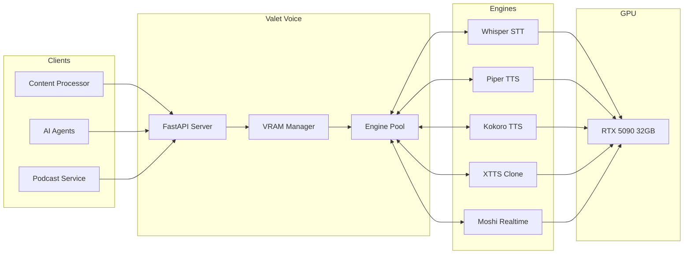
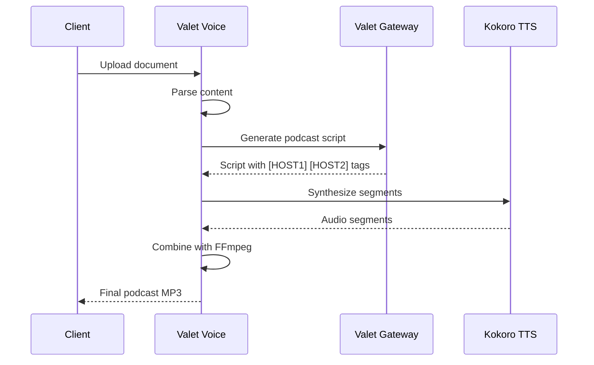

# 🎙️ Valet Voice

> One API for speech recognition, synthesis, and voice cloning

**Home Lab Project** · **7 Models** · **Podcast Generation** · **Voice Cloning**

---

## > The Problem

Voice AI has many specialized models:

- **Whisper** for speech-to-text
- **Piper** for fast TTS
- **Kokoro** for expressive TTS
- **XTTS** for voice cloning
- **Moshi** for real-time conversation

Each has its own API, dependencies, and VRAM requirements. Running them all would exhaust GPU memory.

I needed a unified service that could dynamically manage models and provide a consistent API for all voice tasks.

---

## > The Solution

**Valet Voice** provides a unified REST API for all speech tasks:

```bash
# Speech-to-Text
curl -X POST http://localhost:9550/v1/stt/transcribe \
  -F "file=@recording.wav" \
  -F "model=whisper-large-v3"

# Text-to-Speech
curl -X POST http://localhost:9550/v1/tts/synthesize \
  -H "Content-Type: application/json" \
  -d '{"text": "Hello world", "model": "kokoro-82m", "voice": "af_bella"}'

# Voice Cloning
curl -X POST http://localhost:9550/v1/tts/clone \
  -F "reference=@my_voice.wav" \
  -F "text=Hello in my voice"
```

The service dynamically loads/unloads models based on requests and available VRAM.

---

## > Key Features

- 🎤 **Speech-to-Text** - Whisper (small/medium/large) with language detection
- 🔊 **Text-to-Speech** - Multiple engines (Piper, Kokoro, XTTS)
- 🎭 **Voice Cloning** - Clone any voice from 3-10 seconds of audio
- 😊 **Emotion Control** - Kokoro supports happy, sad, angry, whisper styles
- 🌍 **Multilingual** - XTTS supports 16 languages
- 🎧 **Podcast Generation** - Document to podcast pipeline with LLM scripts
- 💬 **Realtime Voice** - Moshi for full-duplex conversation
- 📊 **VRAM Management** - Dynamic loading with model pinning

---

## > Architecture



The VRAM Manager handles loading/unloading engines based on requests, with support for pinned models that stay loaded.

---

## > Available Models

### Speech-to-Text (STT)

| Model | VRAM | Speed | Description |
|-------|------|-------|-------------|
| **whisper-large-v3** | 2GB | Slow | Best accuracy, 99+ languages |
| **whisper-medium** | 1.5GB | Medium | Good balance |
| **whisper-small** | 500MB | Fast | Quick transcription |

### Text-to-Speech (TTS)

| Model | VRAM | Speed | Description |
|-------|------|-------|-------------|
| **piper** | 500MB | Very Fast | ONNX-based, multiple voices |
| **kokoro-82m** | 2GB | Fast | Expressive with emotion control |
| **xtts-v2** | 4GB | Medium | Voice cloning, 16 languages |

### Realtime Voice

| Model | VRAM | Description |
|-------|------|-------------|
| **moshi-7b** | 16GB | Full-duplex real-time conversation |

---

## > Kokoro Voices

Kokoro supports 10 expressive voices with emotion control:

| Voice | Gender | Accent |
|-------|--------|--------|
| `af_bella` | Female | American |
| `af_nicole` | Female | American |
| `af_sarah` | Female | American |
| `af_sky` | Female | American |
| `am_adam` | Male | American |
| `am_michael` | Male | American |
| `bf_emma` | Female | British |
| `bf_isabella` | Female | British |
| `bm_george` | Male | British |
| `bm_lewis` | Male | British |

### Emotion Styles

- `neutral` - Default speaking voice
- `happy` - Cheerful, upbeat
- `sad` - Somber, melancholic
- `angry` - Intense, forceful
- `surprised` - Excited, astonished
- `whisper` - Quiet, intimate

---

## > Voice Cloning (XTTS)

Clone any voice from a short audio sample:

```bash
# Clone voice and generate speech
curl -X POST http://localhost:9550/v1/tts/clone \
  -F "reference=@speaker_sample.wav" \
  -F "text=This is my cloned voice speaking" \
  -F "language=en"
```

### Supported Languages

XTTS v2 supports 16 languages:

`en` `es` `fr` `de` `it` `pt` `pl` `tr` `ru` `nl` `cs` `ar` `zh-cn` `ja` `hu` `ko`

---

## > Podcast Generation

Convert documents to podcasts with AI-generated scripts:

```bash
# Generate podcast from document
curl -X POST http://localhost:9550/v1/podcast/generate \
  -F "file=@article.md" \
  -F "style=conversational" \
  -F "voices=HOST1,HOST2"
```

### Pipeline



The pipeline:
1. Parses the input document
2. Sends to LLM (via Valet Gateway) for script generation
3. Parses script for speaker tags `[HOST1]`, `[HOST2]`
4. Synthesizes each segment with appropriate voice
5. Combines segments into final MP3

---

## > API Endpoints

### STT (Speech-to-Text)

| Endpoint | Method | Description |
|----------|--------|-------------|
| `/v1/stt/transcribe` | POST | Transcribe audio file |
| `/v1/stt/transcribe/stream` | POST | Streaming transcription |

### TTS (Text-to-Speech)

| Endpoint | Method | Description |
|----------|--------|-------------|
| `/v1/tts/synthesize` | POST | Generate speech from text |
| `/v1/tts/voices` | GET | List available voices |
| `/v1/tts/clone` | POST | Voice cloning synthesis |

### Podcast

| Endpoint | Method | Description |
|----------|--------|-------------|
| `/v1/podcast/generate` | POST | Generate podcast from document |
| `/v1/podcast/{id}/status` | GET | Check generation status |
| `/v1/podcast/{id}/download` | GET | Download generated podcast |

### Models

| Endpoint | Method | Description |
|----------|--------|-------------|
| `/v1/models` | GET | List all models and status |
| `/v1/models/{id}/load` | POST | Load a specific model |
| `/v1/models/{id}/unload` | POST | Unload a specific model |

---

## > TTS Request Example

```json
{
  "text": "Welcome to the Language Seed podcast!",
  "model": "kokoro-82m",
  "voice": "af_bella",
  "style": "happy",
  "speed": 1.0,
  "output_format": "mp3"
}
```

### Response

```json
{
  "success": true,
  "model": "kokoro-82m",
  "voice": "af_bella",
  "duration_sec": 2.4,
  "sample_rate": 24000,
  "audio": "base64..."
}
```

---

## > VRAM Management

The service tracks GPU memory and supports model pinning:

```bash
# Pin models to keep them loaded
PINNED_MODELS=whisper-large-v3,kokoro-82m
```

Models are automatically unloaded after idle timeout (default: 30 minutes) unless pinned.

### Current Budget

| Configuration | Value |
|---------------|-------|
| **VRAM Budget** | 24GB |
| **Idle Timeout** | 1800s (30 min) |
| **Port** | 9550 |

---

## > Tech Stack

| Component | Technology | Why |
|-----------|------------|-----|
| **API** | FastAPI | Async, file upload support |
| **STT** | faster-whisper | CTranslate2 optimized Whisper |
| **TTS (Fast)** | Piper | ONNX runtime, low latency |
| **TTS (Expressive)** | Kokoro | Emotion control, high quality |
| **Voice Cloning** | XTTS v2 | Coqui TTS, multilingual |
| **Realtime** | Moshi | Full-duplex voice AI |
| **Audio** | FFmpeg + soundfile | Format conversion, combining |
| **Metrics** | Prometheus | Observability |
| **Container** | Docker + NVIDIA runtime | GPU passthrough |

---

## > Current Status

| Metric | Value |
|--------|-------|
| **GPU** | RTX 5090 (32GB VRAM) |
| **Available Models** | 7 |
| **TTS Voices** | 10+ (Kokoro) + cloning |
| **Languages** | 99+ (STT) / 16 (TTS cloning) |
| **Port** | 9550 |

Running on my `seed` server.

---

## > What I Learned

1. **faster-whisper is essential** - CTranslate2 makes Whisper 4x faster with less VRAM
2. **Kokoro quality is impressive** - 82M params but sounds natural with emotion
3. **Voice cloning needs clean samples** - 3-10 seconds of clear speech works best
4. **Podcast scripts need structure** - LLM needs explicit speaker tags in prompts
5. **VRAM pinning reduces latency** - Keep frequently-used models loaded

---

## > What's Next

- [ ] Streaming TTS for real-time synthesis
- [ ] Speaker diarization for multi-speaker transcription
- [ ] Music/sound effect library for podcasts
- [ ] ElevenLabs fallback for cloud overflow
- [ ] WebSocket realtime API for Moshi

---

## > Links

- [Whisper](https://github.com/openai/whisper)
- [faster-whisper](https://github.com/SYSTRAN/faster-whisper)
- [Kokoro TTS](https://huggingface.co/hexgrad/Kokoro-82M)
- [Piper TTS](https://github.com/rhasspy/piper)
- [XTTS v2](https://huggingface.co/coqui/XTTS-v2)
- [Moshi](https://github.com/kyutai-labs/moshi)
