> ⚠️ **Note**: This is a personal project running on my home development servers, not a commercial system.

# 🧰 Work Suite

> Lightweight productivity apps with AI-friendly, text-based formats

**Home Lab Project** · **8 Apps** · **LLM-Compatible Formats**


---

## The Problem

Modern productivity tools have become increasingly complex:

- **Heavy dependencies** - npm, build tools, frameworks
- **Proprietary formats** - Binary files AI can't read or generate
- **Cloud-locked** - Can't work offline or self-host
- **AI-hostile** - Formats that break when pasted into LLMs

I wanted tools that produce simple, text-based artifacts that both humans and AI assistants can read, write, and transform.

---

## The Solution

**Work Suite** is a collection of 8 productivity apps that use Markdown, JSON, and plain text. Every app can export to formats that LLMs understand natively.

```
Ask AI: "Create a 5-slide presentation about renewable energy"
→ Copy response into Pointer
→ Instant presentation

Export from Done as JSON
→ Ask AI: "Convert these tasks to a project timeline"
→ Import into Journey
```

---

## The 8 Apps

### Core Productivity

| App | Purpose | Format |
|-----|---------|--------|
| 📝 **Slate** | Keyboard-first notes with tile UI | Markdown, JSON |
| ✅ **Done** | Kanban task board with drag-and-drop | JSON, Markdown |
| 🛤️ **Journey** | Visual timeline creator | JSON, HTML |
| 🐠 **Merman** | Markdown editor with Mermaid diagrams | Markdown |
| 📊 **Metric** | Spreadsheet with formulas and charts | JSON, CSV |
| 👆 **Pointer** | Markdown slide presentations | Markdown, JSON |

### Platform Apps

| App | Purpose |
|-----|---------|
| 🏷️ **Tags** | Central file manager with scopes, folders, and workflow |
| 🎨 **Theme Designer** | Create custom themes from images |

---

## Architecture


---

## Access Scopes

Content is organized into four access levels:

```mermaid
flowchart LR
    subgraph Scopes["Access Scopes"]
        M[👤 Me<br/>Private]
        U[👥 Us<br/>Invited]
        W[🏢 We<br/>Team]
        T[🌐 There<br/>Public]
    end
    
    M --> U --> W --> T
```



| Scope | Access | Use Case |
|-------|--------|----------|
| **Me** | Owner only | Private drafts, personal notes |
| **Us** | Explicit invite | Shared projects, collaborations |
| **We** | Team/workspace | Department resources |
| **There** | External/public | Published content, templates |

---

## AI Workflow

The text-based formats make AI integration seamless:


**Examples:**

- Ask AI: *"Create a project plan with 10 tasks"* → Import JSON into **Done**
- Export **Metric** as CSV → Ask AI: *"Summarize the trends"*
- Ask AI: *"Write a presentation outline"* → Paste Markdown into **Pointer**

---

## App Details

### 📝 Slate — Keyboard-First Notes

- Tile UI for power users
- 100% keyboard navigable
- Command palette (`⌘K`)
- Instant search and tags
- Auto-save to localStorage

### ✅ Done — Kanban Board

- Drag-and-drop cards
- Color-coded labels
- Due dates and priorities
- 5 visual themes
- Export/import as JSON

### 🛤️ Journey — Timeline Creator

- Vertical and horizontal layouts
- Event icons and milestones
- 6 visual themes
- Export to standalone HTML
- Perfect for roadmaps

### 🐠 Merman — Markdown + Diagrams

- Split-pane editor
- Live Mermaid rendering
- Flowcharts, sequences, etc.
- Dark and light themes
- Auto-wrapping for pasted syntax

### 📊 Metric — Spreadsheet

- Formulas: SUM, AVG, MIN, MAX, COUNT, ROUND, SQRT, POW
- Chart types: bar, line, pie, doughnut
- 50 rows × 26 columns
- Quick stats panel
- Export to CSV

### 👆 Pointer — Slide Presenter

- 8 slide layouts (Title, Content, Two-Column, Quote, Code, Section)
- 8 visual themes
- Fullscreen presentation mode
- Keyboard navigation
- Markdown source

---

## File Formats

All formats are human-readable and AI-compatible:

| App | Extension | Format |
|-----|-----------|--------|
| Slate | `.slate` | JSON (notes array) |
| Done | `.done` | JSON (columns + cards) |
| Journey | `.journey` | JSON (events + layout) |
| Merman | `.md` | Markdown |
| Metric | `.metric` / `.csv` | JSON / CSV |
| Pointer | `.pointer` | JSON (slides array) |

---

## Tech Stack

| Component | Technology |
|-----------|------------|
| **Frontend** | Vanilla HTML/JS (no frameworks) |
| **API** | Node.js + Express |
| **Database** | PostgreSQL |
| **Auth** | JWT + HTTP-only cookies |
| **Real-time** | WebSocket |
| **Proxy** | Nginx |
| **Libraries** | Marked.js, Mermaid.js, Chart.js, Prism.js |

---

## Design Philosophy

| Traditional Tools | Work Suite |
|-------------------|------------|
| Complex binary formats | Simple text (Markdown, JSON, CSV) |
| Heavy dependencies | Single HTML files, zero build |
| Proprietary ecosystems | Open, portable, self-contained |
| Difficult for AI | Easy for LLMs to read and generate |

---

## What I Learned

1. **Text formats win** - JSON and Markdown are universally understood
2. **Keyboard-first matters** - Power users live on the keyboard
3. **LocalStorage is enough** - Most personal tools don't need a database
4. **AI compatibility is a feature** - Design for copy-paste workflows

---

## Links

- **Live Demo**: [https://languageseed.github.io/work_suite/](https://languageseed.github.io/work_suite/)
- **GitHub**: [https://github.com/languageseed/work_suite](https://github.com/languageseed/work_suite)
