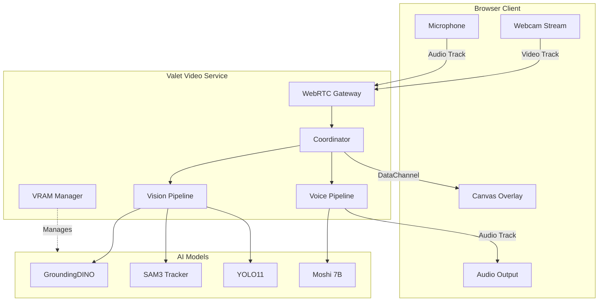
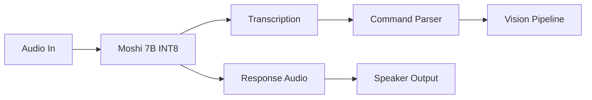

# 🎬 Valet Video

> Real-time webcam streaming with AI object detection, tracking, and voice interaction

**Home Lab Setup** · **GPU**: RTX 5090 32GB · **Latency Target**: <100ms detection

---

## The Problem

I had separate vision and voice services (Valet Visual and Valet Voice), but neither handled real-time video:

- **No live video** - Valet Visual processes static images
- **No streaming** - Can't analyze a webcam feed in real-time
- **No voice control** - Detection prompts had to be typed
- **No object tracking** - Each frame was independent

I wanted to point a webcam at something and say "track the red car" while seeing live bounding boxes.

---

## The Solution

**Valet Video** combines computer vision and conversational voice AI in a single WebRTC-based service. Stream your webcam to the server, get live detection overlays, and use voice commands to control what gets tracked.

```
Browser (WebRTC) ←→ Valet Video ←→ GPU
     ↓                  ↓
  Canvas Overlay    Vision + Voice
  (detection viz)   (SAM3, Moshi)
```

Open `http://localhost:9600/client` in your browser, grant webcam access, and start streaming.

---

## Key Features

- 🎥 **WebRTC Streaming** - Browser-based webcam streaming with sub-100ms target latency
- 🔍 **Real-Time Detection** - GroundingDINO for text-prompted detection, YOLO11 for fast detection
- 📍 **Object Tracking** - SAM3 video predictor for persistent tracking across frames
- 🎙️ **Voice Control** - Speak commands like "find the person in blue" or "track all cars"
- ⚙️ **Quality Profiles** - Multiple resolution/FPS profiles for performance tuning
- 🧠 **Dynamic VRAM** - Automatic model loading/unloading based on demand

---

## Architecture



The service receives video and audio via WebRTC, processes frames through the vision pipeline, handles voice through Moshi, and sends detection results back to the browser via DataChannel for real-time overlay rendering.

---

## Vision Pipeline

The vision pipeline chains detection, segmentation, and tracking:

| Model | Purpose | VRAM |
|-------|---------|------|
| **GroundingDINO** | Text-prompted detection ("find the red car") | 2.5 GB |
| **YOLO11** | Fast general detection (80 classes) | 1.5 GB |
| **SAM3** | Video segmentation and tracking | 4.0 GB |

### Processing Modes

Different modes balance quality vs. speed:

| Mode | Detection Rate | Frame Skip | Use Case |
|------|----------------|------------|----------|
| **realtime** | Every frame | None | Maximum accuracy |
| **balanced** | Every 3rd frame | None | Default - good balance |
| **efficient** | Every 6th frame | Alternate | Lower VRAM |
| **minimal** | Every 10th frame | 2 of 3 | Testing |

When detection is skipped, the pipeline interpolates from the last result and updates tracking status.

---

## Voice Pipeline

The voice pipeline uses Moshi 7B for real-time conversational voice AI:



**Natural language commands:**

- "Find the red car"
- "Track all people"
- "What do you see?"
- "Stop tracking"
- "Focus on the dog"

The command parser routes voice commands to the vision pipeline, updating detection prompts in real-time.

### Fallback Mode

If Moshi isn't available, falls back to:
- **STT**: Whisper Large V3 (3 GB)
- **TTS**: Kokoro (1 GB)

---

## Quality Profiles

Pre-configured profiles for different use cases:

| Profile | Resolution | FPS | VRAM | Use Case |
|---------|------------|-----|------|----------|
| `4k-high` | 3840×2160 | 30 | ~22 GB | Maximum quality |
| `1080p-high` | 1920×1080 | 30 | ~18 GB | **Recommended** |
| `1080p-low` | 1920×1080 | 15 | ~16 GB | Balanced |
| `720p-high` | 1280×720 | 30 | ~17 GB | Fast processing |
| `720p-low` | 1280×720 | 15 | ~15 GB | Low latency |
| `480p` | 854×480 | 30 | ~14 GB | Legacy/testing |

### Service Profiles

Combinations optimized for specific scenarios:

| Profile | Models | VRAM | Max Resolution |
|---------|--------|------|----------------|
| **full** | GroundingDINO + SAM3 + Moshi INT8 | 18 GB | 1080p |
| **vision-only** | GroundingDINO + SAM3 | 8 GB | 4K |
| **voice-only** | Moshi FP16 | 18 GB | N/A |
| **fast-detect** | YOLO11 + Moshi INT8 | 12 GB | 4K |
| **minimal** | YOLO11 only | 3 GB | 4K |

---

## Browser Client

The demo client provides a complete interface:


```
┌─────────────────────────────────────────────────────────────┐
│  [Status: Connected - Streaming]                             │
│  ┌──────────────────────────────────────────────────────┐   │
│  │                                                        │   │
│  │           Webcam Feed with Detection Overlay           │   │
│  │                                                        │   │
│  │    [person: 94%]────────────┐                         │   │
│  │    │                        │                         │   │
│  │    │    Absolute Legend!    │                         │   │
│  │    │                        │                         │   │
│  │    └────────────────────────┘                         │   │
│  │                                                        │   │
│  │  "Track the person" → "I see one person in center"    │   │
│  └──────────────────────────────────────────────────────┘   │
│                                                               │
│  [Controls]           [Detected]         [Performance]       │
│  Profile: 1080p       1: person 94%      FPS: 28             │
│  Mirror: ON           2: laptop 87%      Latency: 45ms       │
│  Boxes: ON                               VRAM: 18.2 GB       │
│  Masks: OFF                              Objects: 2          │
└─────────────────────────────────────────────────────────────┘
```

Features:
- **Mirror/Flip** - Selfie mode or standard view
- **Visualization toggles** - Bounding boxes, segmentation masks, motion trails
- **Real-time stats** - FPS, latency, VRAM usage
- **Detected object list** - Label, confidence, tracking status

---

## API Endpoints

### REST API

```
GET  /health              # Service health
GET  /health/vram         # VRAM status and allocation
GET  /profiles            # Available quality profiles
POST /sessions            # Create streaming session
GET  /sessions/{id}       # Get session details
DELETE /sessions/{id}     # End session
GET  /models              # Loaded models status
POST /models/{name}/load  # Load a model
```

### WebSocket

```
WS /ws/signaling/{session_id}   # WebRTC signaling
WS /ws/stream/{session_id}      # Frame streaming (fallback)
```

### DataChannel Messages

Detection results streamed in real-time:

```json
{
  "type": "detections",
  "frame_id": 12345,
  "timestamp": 1704931200.456,
  "processing_time_ms": 45,
  "detections": [
    {
      "id": 1,
      "label": "red car",
      "confidence": 0.94,
      "bbox": [120, 340, 380, 520],
      "tracking_status": "stable",
      "velocity": [2.5, 0.1],
      "color": "#FF4444"
    }
  ]
}
```

---

## VRAM Management

Dynamic VRAM allocation prevents conflicts:

```yaml
vram:
  limit_gb: 28           # Reserve 4GB headroom
  warning_gb: 24
  
  allocation:
    vision: 8            # GroundingDINO + SAM3
    voice: 10            # Moshi INT8
    buffers: 4           # Frame/audio buffers
    system: 6            # Headroom
```

The VRAM manager:
- Tracks all model allocations
- Prevents over-allocation
- Estimates frame buffer requirements based on resolution
- Reports utilization via `/health/vram`

### Frame Buffer Estimates

| Resolution | Buffers (6) | VRAM |
|------------|-------------|------|
| 4K | 3.2 GB | ~3.2 GB |
| 1080p | 0.8 GB | ~0.8 GB |
| 720p | 0.4 GB | ~0.4 GB |

---

## Running It

### Prerequisites

- NVIDIA GPU with 24+ GB VRAM (RTX 4090/5090)
- Docker with NVIDIA Container Toolkit
- Modern browser with WebRTC support

### Quick Start

```bash
cd valet-video
docker compose up -d

# Check status
curl http://localhost:9600/health

# Open browser client
open http://localhost:9600/client
```

### HTTPS for Remote Access

Webcam access requires a secure context. For remote access:

```bash
# Option 1: SSH tunnel
ssh -L 9600:localhost:9600 your-server
# Then open http://localhost:9600/client

# Option 2: Enable HTTPS
./scripts/generate-ssl-cert.sh
# Set SSL_KEYFILE and SSL_CERTFILE env vars
```

---

## Tech Stack

| Component | Technology | Why |
|-----------|------------|-----|
| **API** | FastAPI + Uvicorn | Async, WebSocket support |
| **WebRTC** | aiortc | Python WebRTC implementation |
| **Detection** | GroundingDINO, YOLO11 | Text-prompted + fast detection |
| **Tracking** | SAM3 | Video object tracking |
| **Voice** | Moshi 7B | Real-time conversational |
| **Fallback** | Whisper + Kokoro | STT + TTS when Moshi unavailable |
| **Container** | Docker + CUDA | GPU-accelerated deployment |

---

## My Home Lab Setup

Running on my home dev environment:

| Component | Spec |
|-----------|------|
| **GPU** | RTX 5090 32GB |
| **Profile** | 1080p-high (18 GB VRAM) |
| **Models** | GroundingDINO + SAM3 + Moshi INT8 |
| **Port** | 9600 |

I access it via SSH tunnel from my laptop. Detection latency is typically 45-60ms with stable 28 FPS at 1080p.

---

## Related Services

Valet Video integrates components from:

- **[Valet Visual](/hello_world/portfolio/2026-01-13-valet-visual)** - Vision models (GroundingDINO, SAM)
- **[Valet Voice](/hello_world/portfolio/2026-01-13-valet-voice)** - Voice models (Moshi, Whisper)
- **[Valet Model Runtime](/hello_world/portfolio/2026-01-13-valet-model-runtime)** - Model orchestration

---

## What I Learned

Building real-time video AI taught me:

1. **WebRTC is complex** - ICE negotiation, STUN/TURN, DataChannels - lots of moving parts
2. **Frame rate vs. detection rate** - Processing every frame isn't necessary; interpolation works well
3. **VRAM is precious** - At 1080p with full stack, 18GB of 32GB is used
4. **Voice adds magic** - Natural language commands make the system feel alive
5. **Browser security matters** - HTTPS or localhost required for webcam access

---

## What's Next

- [ ] Multi-session support (currently single session)
- [ ] Mobile browser testing
- [ ] TURN server for NAT traversal
- [ ] Recording and playback
- [ ] Segment anything in video (click-to-track)
