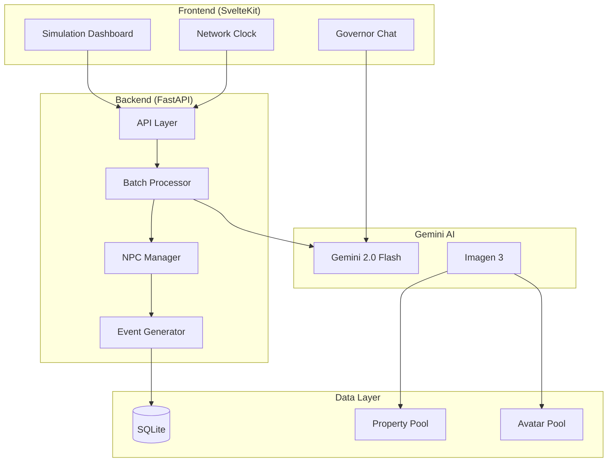
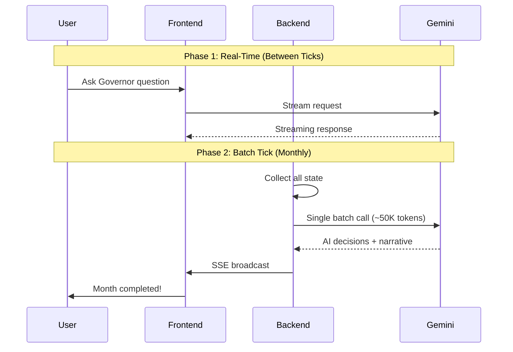
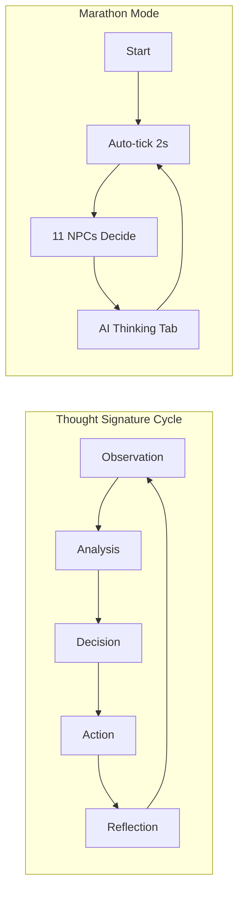
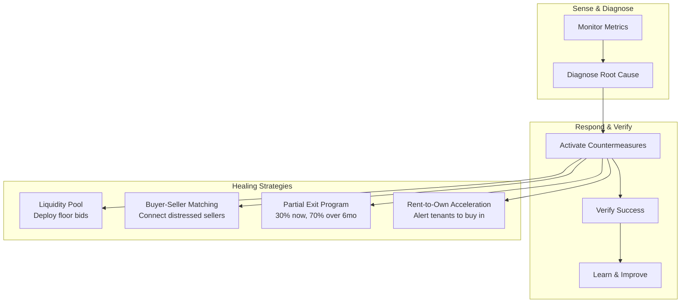

# 🏠 OSF - Open Source Fund

> AI-driven property tokenization simulation for learning, not investing

---

## > What is OSF?

OSF (Open Source Fund) is an educational simulation that demonstrates how AI could manage a transparent, community-governed property investment network. Built for the **Gemini 3 Hackathon** (Marathon Agent track), it allows users to explore property tokenization concepts without any financial risk.

| Aspect | Details |
|--------|---------|
| **Type** | Educational sandbox |
| **Stack** | SvelteKit, FastAPI, SQLite |
| **AI** | Gemini 2.0 Flash, Imagen 3 |
| **Hackathon** | Gemini 3 (Deadline: Feb 9, 2026) |
| **Track** | Marathon Agent |

> ⚠️ **Note**: This is a hackathon project for educational purposes. No real money, no real assets, no financial advice.

---

## > Architecture



---

## > Two-Phase Processing Model

The core innovation is a **two-phase architecture** that optimizes token usage while maintaining interactivity:



### Phase Details

| Phase | Model | Context | Purpose |
|-------|-------|---------|---------|
| Real-time chat | Gemini Flash | ~10K tokens | Governor/Advisor Q&A |
| Batch processing | Gemini Flash | ~50K tokens | Monthly simulation tick |
| Property images | Imagen 3 | N/A | Isometric renders |
| Character avatars | Imagen 3 | N/A | NPC/user avatars |

---

## > Marathon Agent Implementation

OSF demonstrates the Marathon Agent pattern through autonomous simulation:



### Marathon Mode Features

| Feature | Implementation |
|---------|----------------|
| **Duration** | 120 months (10 years) at 2s/tick ≈ 4 hours |
| **NPCs** | 11 unique personalities with goal-driven behavior |
| **Self-correction** | NPCs adjust risk tolerance based on performance |
| **Visible reasoning** | AI Thinking tab shows all decisions live |
| **Session continuity** | Tracks elapsed time and total months |

---

## > Self-Healing Network

Unlike traditional markets, OSF can detect and recover from stress:



### Health Indicators

| Metric | Healthy Threshold |
|--------|-------------------|
| Liquidity | >80% |
| Exit Queue | <5 requests |
| Trade Failures | <15% |
| Occupancy | >95% |
| Rent Collection | >98% |

---

## > Explorable Roles

Users can experience property from 6 different perspectives:

| Role | Experience |
|------|------------|
| **Investor** | Buy/sell tokens, track portfolio, vote on proposals |
| **Renter** | Select property, pay rent, request maintenance |
| **Tenant** | Rent-to-own pathway, equity accumulation |
| **Homeowner** | Equity access, rental income, property listing |
| **Service Provider** | Complete tasks as plumber, electrician, manager |
| **Foundation** | Stake tokens, enhanced governance, yields |

### Connected Roles

When a homeowner accesses equity, their holdings appear in the investor view:

```
Homeowner accesses $50K equity
        ↓
Receives OSF tokens (marked "Your Home Equity")
        ↓
Tokens appear in Investor portfolio
        ↓
Tokens earn dividends like regular investments
```

---

## > Cooperative Gamification

OSF intentionally avoids competitive mechanics:

| Traditional Games | OSF Approach |
|-------------------|--------------|
| Beat other players | Contribute to network health |
| Maximize personal wealth | Support collective outcomes |
| Individual rankings | Network health grade (A-F) |
| Competitive leaderboards | Exploration achievements |

### Collective Outcomes

| Outcome | What It Measures |
|---------|------------------|
| Families Housed | Stable housing provided |
| Dividends Distributed | Shared with token holders |
| Equity Accessed | Homeowners helped |
| Crises Survived | Downturns weathered |
| Evictions | 0 (OSF prevents this) |
| Foreclosures | 0 (cooperative model) |

### Exploration Achievements

- **First Investment** - Make your first token purchase
- **Weathered Storm** - Hold during a market downturn
- **Witnessed Boom** - Experience a boom market
- **Saw Self-Healing** - Watch the network recover
- **Full Cycle** - Complete a full boom-bust cycle
- **Network Anchor** - Maintain holdings during crisis

---

## > WA Market Dynamics

The simulation is calibrated to Western Australian property data:

| Metric | Value | Source |
|--------|-------|--------|
| Median house price (Perth) | ~$750,000 | REIWA |
| Rental vacancy rate | <1% | REIWA |
| Gross rental yield (houses) | ~4.5% | CoreLogic |
| Gross rental yield (units) | ~6.0% | CoreLogic |
| Population growth | ~2.3% | WA Treasury |

### Boom-Bust Cycle

| Condition | Monthly Appreciation | Triggers |
|-----------|---------------------|----------|
| **Boom** | +0.6% to +1.2% | Iron ore >$150/t, pop growth >2% |
| **Stable** | +0.2% to +0.4% | Iron ore >$100/t |
| **Stagnant** | -0.1% to +0.1% | Extended peak, buyer hesitation |
| **Declining** | -0.5% to -0.2% | Iron ore <$100/t |
| **Bust** | -1.0% to -0.5% | Iron ore <$80/t, population outflow |

---

## > Tech Stack

| Layer | Technology |
|-------|------------|
| Frontend | SvelteKit 2.0, Svelte 5 Runes, TypeScript |
| UI Components | shadcn-svelte, Lucide icons, Chart.js |
| Interactive Diagrams | @xyflow/svelte (Money Flow, Self-Healing) |
| Backend | FastAPI, Python 3.11+, SQLAlchemy 2.0 |
| Database | SQLite (demo) / PostgreSQL (production) |
| AI | Gemini 2.0 Flash (streaming), Imagen 3 |
| Real-time | Server-Sent Events (SSE) |
| Market Data | RBA, ABS, APRA, REIWA, PropTrack |

---

## > API Overview

### Clock Endpoints

```bash
# Get clock status
GET /network/clock/status

# Start marathon mode
POST /network/clock/start

# Force tick (debug)
POST /network/clock/force-tick

# SSE event stream
GET /network/clock/stream
```

### AI Endpoints

```bash
# Chat with Governor (streaming)
GET /network/governor/chat/stream?message=How%20is%20the%20network?

# Portfolio advice
POST /network/advisor/portfolio
```

---

## > Key Innovations

### 1. Batch Context Maximization

Single Gemini call processes entire monthly state instead of hundreds of individual requests.

### 2. Emergent NPC Dynamics

11 NPCs with unique personalities create realistic market behavior without scripting.

### 3. Self-Healing Mechanisms

Network can coordinate participants to solve problems traditional markets cannot.

### 4. Cooperative Design

Rewards network health and learning, not wealth accumulation or competition.

### 5. Connected Role State

Homeowner actions flow through to investor portfolios, demonstrating real token economics.

---

## > Running Locally

```bash
# Backend
cd projects/osf-demo/backend
export GOOGLE_API_KEY=your_key
USE_SQLITE=true uvicorn src.main:app --port 8000

# Frontend
cd projects/osf-demo/frontend
npm run dev
```

---

## > Project Status

This is a hackathon project submitted for the Gemini 3 Hackathon (Marathon Agent track). It demonstrates AI capabilities in autonomous, long-running simulations with cooperative mechanics.

**What it is:**
- Educational simulation
- Hackathon demo
- Proof of concept

**What it is NOT:**
- Financial product
- Investment advice
- Production system

---

## > Links

- **Track**: Marathon Agent
- **Prize Pool**: $100,000
- **Deadline**: February 9, 2026
