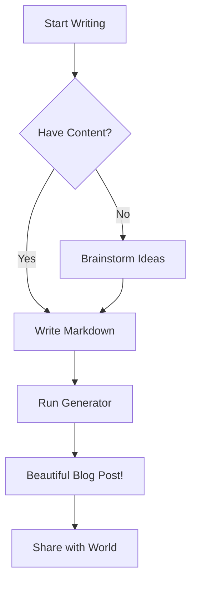
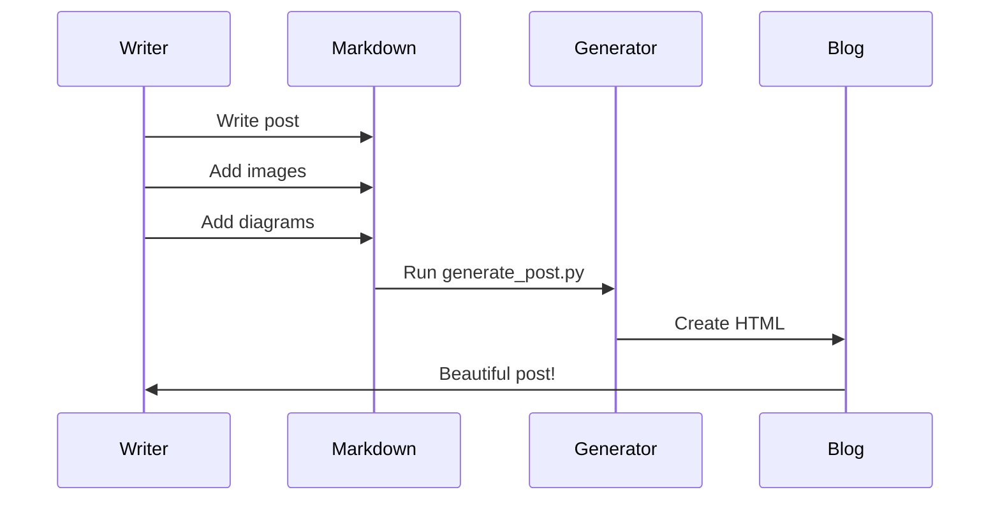
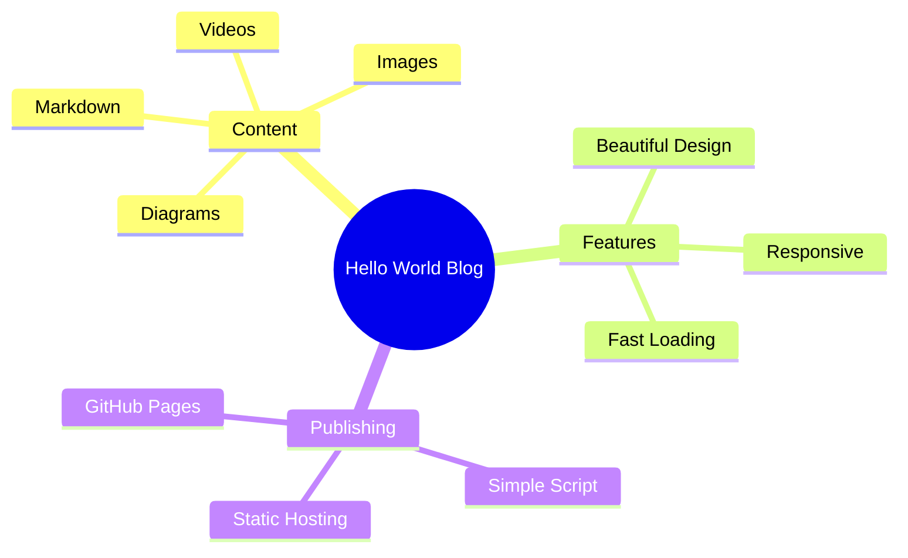
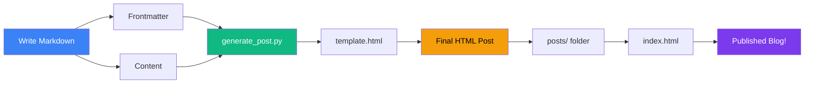
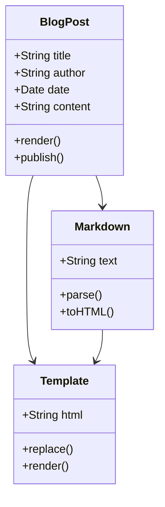

# Welcome to Hello World!

This is an example blog post demonstrating all the features available in your new blog system. You can write in **Markdown**, include images, create diagrams with Mermaid, and much more!

## What Can You Do?

This blog template supports a wide variety of content types:

- 📝 **Rich Markdown formatting**
- 🖼️ **Images and media**
- 📊 **Mermaid diagrams**
- 💻 **Code blocks with syntax highlighting**
- 📋 **Tables**
- 🎨 **Blockquotes and callouts**

---

## Adding Images

You can easily add images to your blog posts. Just place your images in the `images/` folder and reference them in your markdown:


### Image Syntax

Use standard markdown syntax:

```markdown

```

Images will automatically be:
- Responsive (scale to fit)
- Beautifully rounded with shadows
- Centered with proper spacing

---

## Creating Diagrams with Mermaid

One of the most powerful features is Mermaid diagram support. You can create flowcharts, sequence diagrams, and more!

### Flowchart Example



### Sequence Diagram



### Mind Map



---

## Code Examples

You can include code blocks with syntax highlighting:

### Python Example

```python
def generate_post(markdown_file):
    """Generate a beautiful blog post"""
    with open(markdown_file, 'r') as f:
        content = f.read()
    
    # Process and generate HTML
    html = convert_to_html(content)
    return html

print("Hello, World!")
```

### JavaScript Example

```javascript
const blogPost = {
    title: "My Post",
    author: "Language Seed",
    tags: ["markdown", "blogging", "awesome"]
};

console.log(`Publishing: ${blogPost.title}`);
```

### Inline Code

You can also use `inline code` like this for variable names or short snippets.

---

## Tables

Create beautiful, responsive tables:

| Feature | Description | Status |
|---------|-------------|--------|
| Markdown Support | Full GFM support | ✅ Complete |
| Mermaid Diagrams | All diagram types | ✅ Complete |
| Image Support | PNG, JPG, GIF, WebP | ✅ Complete |
| Code Highlighting | Syntax highlighting | ✅ Complete |
| Responsive Design | Mobile-friendly | ✅ Complete |
| Dark Mode | Coming soon | 🚧 Planned |

---

## Lists

### Unordered Lists

- First item with **bold** text
- Second item with *italic* text
- Third item with `code`
  - Nested item 1
  - Nested item 2
    - Even deeper nesting!

### Ordered Lists

1. Write your markdown file
2. Add frontmatter with title, author, date
3. Run the generator script
4. Deploy your beautiful blog!

---

## Blockquotes

> "The best way to predict the future is to invent it."
> 
> — Alan Kay

You can use blockquotes for emphasis, quotes, or callouts. They're beautifully styled with a colored border and subtle background.

---

## Architecture Diagram Example

Here's a more complex Mermaid diagram showing the blog architecture:



---

## Advanced Mermaid: Class Diagram



---

## Next Steps

Now that you've seen what's possible, here's how to create your own posts:

1. **Create a markdown file** with frontmatter
2. **Add your content** using markdown syntax
3. **Include images** in the `images/` folder
4. **Run the generator**: `python generate_post.py your-post.md`
5. **Open the HTML** in your browser

Happy blogging! 🚀

---

## Resources

- [Markdown Guide](https://www.markdownguide.org/)
- [Mermaid Documentation](https://mermaid.js.org/)
- [GitHub Flavored Markdown](https://github.github.com/gfm/)

---

*This post was created on November 12, 2025, and demonstrates the full capabilities of the Hello World blog system.*

