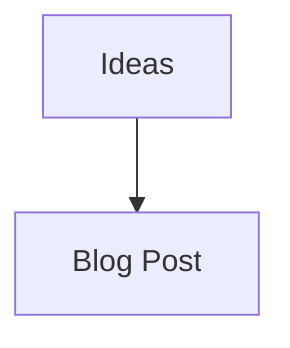

# 📝 Post Organization & Workflow Guide

## 📂 How Posts Are Organized

### Two-Folder System

Your blog uses a **source → output** workflow:

```
┌─────────────────────────────────────────┐
│ ROOT DIRECTORY (source files)          │
│                                         │
│ ✏️  2025-11-12-getting-started.md      │
│ ✏️  example-post.md                    │
│ ✏️  test-mermaid.md                    │
│                                         │
│         ↓ (run generate_post.py)       │
│                                         │
├─────────────────────────────────────────┤
│ posts/ DIRECTORY (generated HTML)      │
│                                         │
│ 📄 2025-11-12-getting-started.html     │
│ 📄 example-post.html                   │
│ 📄 test-mermaid.html                   │
└─────────────────────────────────────────┘
```

### Current Files

**Markdown Sources (you edit these):**
- `2025-11-12-getting-started.md` - New getting started post
- `example-post.md` - Full feature demo
- `test-mermaid.md` - Mermaid diagram test

**Generated HTML (automatically created):**
- `posts/2025-11-12-getting-started.html`
- `posts/example-post.html`
- `posts/test-mermaid.html`

## 🆕 Creating a New Post - Complete Workflow

### Step 1: Write Your Markdown File

**Naming Convention (Recommended):**
```
YYYY-MM-DD-post-title.md
```

Examples:
- `2025-11-12-my-first-post.md`
- `2025-11-13-python-tips.md`
- `2025-12-01-year-in-review.md`

**Create the file in the ROOT directory:**

```bash
cd /Users/ben/Documents/Language_Seed_AI_Hello_World
nano 2025-11-13-my-new-post.md
```

**File Structure:**

```markdown
---
title: Your Post Title Here
author: language seed
date: 2025-11-13
---

# Your Post Title

Your content here...

## Add sections

More content...




```

**Frontmatter Rules:**
- Must be at the very top
- Surrounded by `---`
- Contains: title, author, date
- Date format: YYYY-MM-DD

### Step 2: Generate HTML

```bash
python generate_post.py 2025-11-13-my-new-post.md
```

**Output:**
```
✅ Generated: posts/2025-11-13-my-new-post.html
   Title: Your Post Title Here
   Author: language seed
   Date: 2025-11-13
```

### Step 3: Preview Locally

```bash
open posts/2025-11-13-my-new-post.html
```

Check:
- ✅ Text formatting looks good
- ✅ Images load (if any)
- ✅ Mermaid diagrams render
- ✅ Code blocks display correctly
- ✅ Back button works

### Step 4: Add to Index (Optional but Recommended)

You have two options:

**Option A: Use the helper script**
```bash
python update_index.py
# Choose option 2 to generate cards
# Copy the HTML output
```

**Option B: Manual edit**

Edit `index.html` and add a card in the `<div class="posts-grid">` section:

```html
<div class="post-card" onclick="window.location.href='posts/2025-11-13-my-new-post.html'">
    <div class="post-card-header">
        <h3>Your Post Title Here</h3>
        <div class="post-card-meta">
            By language seed • November 13, 2025
        </div>
    </div>
    <div class="post-card-body">
        <p class="post-card-excerpt">
            A brief description of your post goes here...
        </p>
        <a href="posts/2025-11-13-my-new-post.html" class="post-card-link">Read More →</a>
    </div>
</div>
```

### Step 5: Commit & Push to GitHub

```bash
git add .
git commit -m "Add new post: Your Post Title"
git push origin main
```

### Step 6: Wait for Deployment

```bash
# Check deployment status
gh api repos/languageseed/hello_world/pages

# Status will change from "building" to "built"
```

Typically takes **1-10 minutes**.

### Step 7: View Live!

Visit: `https://languageseed.github.io/hello_world/`

## 📋 Quick Reference Commands

```bash
# Create new post
nano 2025-11-13-my-post.md

# Generate HTML
python generate_post.py 2025-11-13-my-post.md

# Preview locally
open posts/2025-11-13-my-post.html

# See all posts
ls -lh *.md              # Source files
ls -lh posts/*.html      # Generated HTML

# Deploy
git add .
git commit -m "Add new post"
git push origin main

# Check status
gh api repos/languageseed/hello_world/pages
```

## 🗂️ Organizing Many Posts

### Option 1: Date-Based Naming (Recommended)
Keep all markdown files in root with dates:
```
2025-11-12-getting-started.md
2025-11-13-python-tips.md
2025-11-14-react-hooks.md
```

**Pros:**
- Easy to sort by date
- Clear chronology
- Works with current setup

### Option 2: Create Subdirectories (Advanced)

```
posts-source/
├── 2025/
│   ├── 11/
│   │   ├── getting-started.md
│   │   └── python-tips.md
│   └── 12/
│       └── year-review.md
└── drafts/
    └── work-in-progress.md
```

Then generate from subdirectory:
```bash
python generate_post.py posts-source/2025/11/getting-started.md
```

### Option 3: Category-Based

```
tech-posts.md
learning-notes.md
project-updates.md
```

## 🎯 Best Practices

### File Naming
✅ **Good:**
- `2025-11-12-my-post.md`
- `getting-started.md`
- `python-tips-and-tricks.md`

❌ **Avoid:**
- `My Post.md` (spaces)
- `POST123.md` (not descriptive)
- `temp.md` (not meaningful)

### Markdown Files
- Keep in root directory (current setup)
- Use descriptive names
- Include dates in filename
- One post = one file

### Generated HTML
- Never edit manually (will be overwritten)
- Always in `posts/` directory
- Same name as source markdown
- Automatically created by script

### Images
- Store in `images/` folder
- Use lowercase filenames
- Optimize before adding
- Reference as `../images/name.jpg` from posts

## 🔄 Regenerating Posts

If you update a markdown file:

```bash
# Edit the markdown
nano example-post.md

# Regenerate (overwrites HTML)
python generate_post.py example-post.md

# Push updates
git add .
git commit -m "Update example post"
git push origin main
```

## 📊 Current Blog Status

Run this to see what you have:

```bash
echo "=== Markdown Sources ==="
ls -1 *.md | grep -v "README\|DEPLOYMENT\|QUICK_START\|POST_WORKFLOW"

echo -e "\n=== Generated HTML ==="
ls -1 posts/*.html

echo -e "\n=== Images ==="
ls -1 images/ 2>/dev/null | grep -v README || echo "No images yet"
```

## 🚀 Example Complete Workflow

```bash
# 1. Create new post
cat > 2025-11-13-hello.md << 'EOF'
---
title: Hello World
author: language seed
date: 2025-11-13
---

# Hello!

This is my new post.
EOF

# 2. Generate HTML
python generate_post.py 2025-11-13-hello.md

# 3. Preview
open posts/2025-11-13-hello.html

# 4. Deploy
git add .
git commit -m "Add hello post"
git push origin main

# Done! ✨
```

## 💡 Tips

1. **Keep markdown files** - Don't delete them! They're your source.
2. **Use the date format** - Makes sorting easy
3. **Preview before pushing** - Catch errors early
4. **Update index.html** - So people can find your post
5. **Commit often** - Small commits are better

## 🆘 Need Help?

```bash
# See what posts exist
ls *.md

# Generate any post
python generate_post.py your-file.md

# Check what's deployed
gh api repos/languageseed/hello_world/pages

# View your blog
open https://languageseed.github.io/hello_world/
```

---

**Happy blogging! 🌱**

