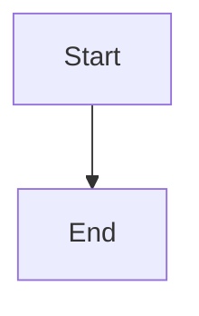

# 🚀 Quick Start - Your Blog is Live!

Your blog is now live at: **https://languageseed.github.io/hello_world/**

## ✅ What's Deployed

- ✅ Main blog index page
- ✅ Example post with full features
- ✅ Mermaid test post
- ✅ Beautiful responsive design
- ✅ All images, fonts, and diagrams working

## 📝 Adding New Posts (3 Simple Steps)

### 1. Create Your Markdown File

```bash
# Create a new post file
nano my-new-post.md
```

Add frontmatter and content:
```markdown
---
title: My Amazing New Post
author: language seed
date: 2025-11-12
---

# Hello World!

Your content here...
```

### 2. Generate the HTML

```bash
python generate_post.py my-new-post.md
```

### 3. Push to GitHub

```bash
git add .
git commit -m "Add new post: My Amazing New Post"
git push origin main
```

**That's it!** GitHub Pages will automatically rebuild (takes 1-10 minutes).

## 🎨 Features You Can Use

### Images
```markdown

```
Just add images to the `images/` folder first.

### Mermaid Diagrams
````markdown

````

### Code Blocks
````markdown
```python
print("Hello, World!")
```
````

### All Markdown
- **Bold**, *italic*, `code`
- Lists, tables, blockquotes
- Links: `[text](url)`
- And more!

## 🔄 Update Workflow

```bash
# 1. Create or edit markdown files
# 2. Generate HTML
python generate_post.py your-post.md

# 3. (Optional) Update index.html to list new post
python update_index.py

# 4. Commit and push
git add .
git commit -m "Your message"
git push origin main

# 5. Wait for GitHub Pages to rebuild
# Check: gh api repos/languageseed/hello_world/pages
```

## 🌐 Your URLs

- **Main Blog**: https://languageseed.github.io/hello_world/
- **Example Post**: https://languageseed.github.io/hello_world/posts/example-post.html
- **Test Post**: https://languageseed.github.io/hello_world/posts/test-mermaid.html

## 🛠️ Useful Commands

```bash
# Check GitHub Pages status
gh api repos/languageseed/hello_world/pages

# Open blog in browser
open https://languageseed.github.io/hello_world/

# Generate a post
python generate_post.py my-post.md

# See what posts exist
ls posts/

# Check git status
git status

# View repository on GitHub
gh repo view --web
```

## 📋 Adding Posts to Index

After generating a post, you need to add it to `index.html`:

1. Run the helper:
   ```bash
   python update_index.py
   ```

2. It will show you the HTML card code

3. Copy and paste into `index.html` in the `<div class="posts-grid">` section

4. Commit and push!

## 🎯 Tips

- **Optimize images** before adding (compress them)
- **Test locally** by opening HTML files in browser
- **Use descriptive filenames** like `2025-11-12-my-post.md`
- **Commit often** with clear messages
- **Check browser console** (F12) if something doesn't work

## 🐛 Troubleshooting

### Mermaid not rendering?
- Make sure syntax is correct
- Check browser console for errors
- Viewing over HTTPS (not file://)

### Images not showing?
- Files in `images/` folder?
- Using `../images/name.jpg` from posts?
- Files committed to git?

### Changes not showing up?
- Wait 1-10 minutes for GitHub Pages to rebuild
- Check status: `gh api repos/languageseed/hello_world/pages`
- Hard refresh browser (Cmd+Shift+R)

## 🎉 You're All Set!

Your blog is live and ready to use. Start writing and sharing your ideas!

**Happy Blogging! 🌱**

